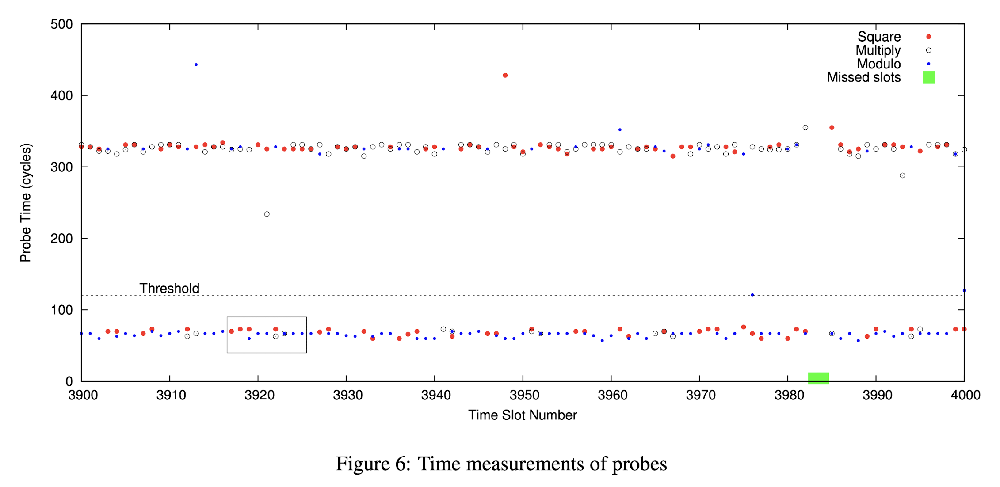
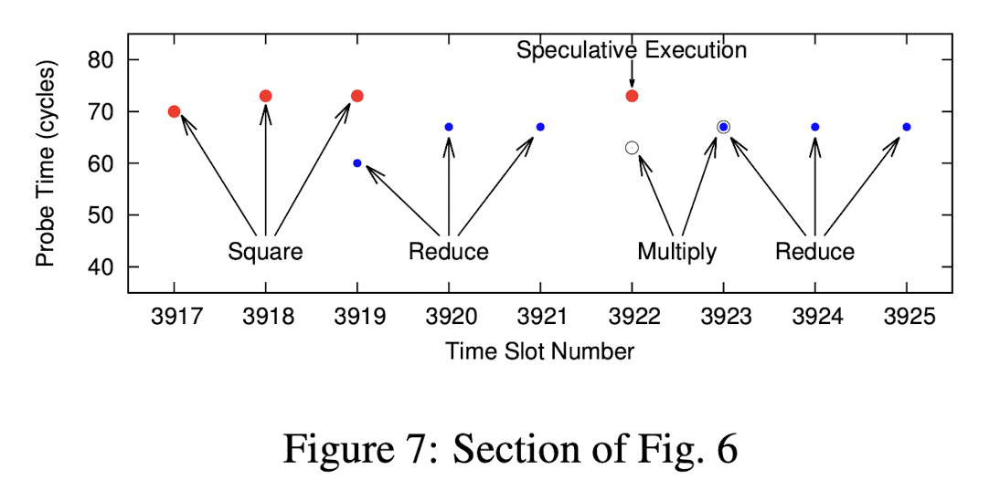
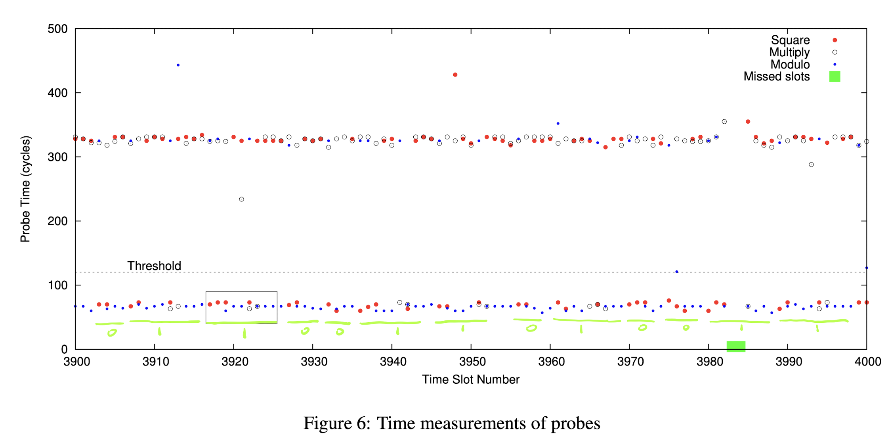

本次分享的论文被收录于 2014 年的 USENIX Security。第一作者 Yarom 在侧信道攻击领域有很多精彩的作品。今天要介绍的 FLUSH+RELOAD 攻击是其中有代表性的一篇。这篇文章发表至今已经有近八年，其中一些技术细节已经过时，但是它可以作为一个绝妙的 demo 来展示侧信道攻击的思路，这些思路至今依然没有过时。

作为学术文章，原文中只对学术界最关心的核心问题进行了阐述。为了更完整地讲解整个故事，我会对原文省略的步骤做一些补充。

---

## 背景介绍

侧信道攻击（Side-Channel Attack）是一种十分有魅力的攻击。传统的攻击（比如memory corruption）多是逻辑上的漏洞，而侧信道攻击一般利用程序运行的时间、环境（电磁场、温度等）等反推机密信息。侧信道攻击主要针对的是计算机安全领域 CIA（Confidentiality, Integrity and Availability）中的 C ，比如通过程序执行时间长短来窃取秘钥等信息。侧信道漏洞分为软件漏洞和硬件漏洞，其中后者威胁更为强大，因为一旦硬件被部署，就无法根除，最多只能从软件上做一些方法来限制、减弱这些攻击的威力。

Trusted Execution Environment （可信执行环境， TEE）是一种依赖硬件隔离手段来保护程序运行的技术。随着 TEE 技术的发展，传统的 memory corruption 类型的漏洞威胁程度逐渐被降低，而侧信道攻击则逐渐引起人们的重视，因为一个硬件上的侧信道漏洞就可能足以导致整个 TEE 被攻破。至今针对不同平台的 TEE （Intel 的 SGX， Arm 的 TrustZone，AMD 的 SEV等）都已经有很多侧信道攻击工作。

本文介绍的侧信道攻击 FLUSH+RELOAD 利用的是硬件中的三级缓存 （L3 Cache），通过测量访问时间来获取秘钥信息，属于侧信道攻击中的 Cache Timing Attack。

---

## 攻击思路

### RSA 算法简要回顾

【Reminder：不喜欢数学的可以跳过这一段】RSA 是目前主流的加密算法之一，它的安全性依赖大数分解问题的复杂程度。大数分解问题即给定 $n=pq$（其中 $p$ 和 $q$ 是两个大素数）后，很难由 $n$ 求出 $p$ 和 $q$ 的值。在 RSA 中，我们还要选定一个公共的指数 $e$，比如在 GnuPG 的实现中，$e$ 的值默认为 65537。随后由 $(n,e)$ 作为公钥，$(p,q,d)$ 作为私钥，其中
$$
d\equiv e^{-1}\mod ((p-1)(q-1)).
$$
而 RSA 具体实现中，有一些常见的优化，首先可以用中国余数定理把 $d$ 分成 $d_p\equiv d\mod(p-1)$ 和 $d_q\equiv d\mod(q-1)$ 两个部分。对密文 $c$ 的解密也将分为 $m_p \equiv c^{d_p} \mod p$ 和 $m_q \equiv c^{d_q} \mod q$ 两个部分。最后使用 Garner's Formula
$$
\begin{aligned}
h&=(m_p-m_q)(q^{-1}\mod p)\mod p,\\\\
m&=m_q+hq
\end{aligned}
$$
复原密文 $m$。值得注意的是，对 $d_p$ 或者 $d_q$ 其一的破解即可破解整个秘钥。

**如果你碰巧没看到上面那段话，你只需要知道解密过程中需要计算：**
$$
m\equiv c^d\mod p,
$$
其中私钥 $d$ 是算法的关键，也是我们攻击的目标。

### RSA 实现中的快速幂

由于 $d$ 是个很大的数字，计算 $c^d$ 的具体实现中会使用快速幂来优化效率。快速幂的思路是，我们把 $d$ 按二进制表示成
$$
d=2^{k-1}d_{k-1}+\cdots+2^0d_0,
$$
因此
$$
c^d=c^{\sum_i2^id_i}=\prod_{i=0}^{k-1}c^{2^id_i}=\prod_{d_i=1}c^{2^i}.
$$
于是我们可以使用 Square-and-Multiply 的方法来计算 $c^d$，伪代码如下：
```C
bigint exp_mod(c,d,p)
{
	bigint x = 1;
	for (int i = k - 1; i >= 0; i--) {
		x = x * x; // square
		x = x % p; // reduce
		if (d[i] == 1) { // d[i] are the bits of number d
			x = x * c; // multiply
			x = x % p; // reduce
		}
	}
	return x;
}
```

### 快速幂带来的隐患

这段非常常见的快速幂算法其实给侧信道攻击提供了可能。在循环体每一次执行中，如果 `d[i]` 的值是 0，那么该次执行流程是 Square-Reduce；如果 `d[i]` 是 1，那么执行流程是 Square-Reduce-Multiply-Reduce。因此，私钥 $d$ 的全部信息被包含在了程序运行的 control flow 中。也就是说，**如果我们能想办法 trace 整个程序的执行，那么就有办法从程序的 control flow 中 recover 私钥 $d$**，即观察每次循环中，Multiply-Reduce 部分的代码是否被执行。

### 一些操作系统知识的回顾

我们假设攻击者只是一个普通的进程，那么他显然没办法随意地观测其他进程的执行。而这就是 Cache Timing Attack 的用武之地了。

在介绍具体的攻击方式之前，我们先回忆一些操作系统的基础知识。首先，系统中进程是资源分配的单元，每个进程有自己的虚拟地址空间，有自己的一系列文件描述符。其次，当多个进程打开同一个文件时，系统会用 Copy-on-Write (COW) 的方式透明地让它们 share 同一个文件。也就是说，当文件从磁盘加载到内存后，如果文件始终没有被修改，那么无论多少进程打开了它，在内存中都只有一份共享的物理页，这些页被映射到进程各自的虚拟地址空间。直到某个进程对文件内容进行了修改，系统才会复制该页，再修改进程的映射，让其访问到新的物理页，而其他进程继续共享原有未被修改的物理页。COW 的过程逻辑上对所有进程是透明的，即理论上进程自己感知不到资源被与其他进程共享了。最后，当代系统支持动态链接库：静态链接的程序会在自己内部包含所有代码，这会导致二进制文件很大，而动态链接可以让每个二进制文件只包含自己独立的部分，动态链接库的部分在运行时被链接器装载到进程里。

说到文件操作，我们熟悉的往往是自己写代码时手动打开的文件，比如写个简单的程序，在 `main` 里调用 `open` 等函数。但实际上进程会自动打开一些文件，比如动态链接库。动态链接库本质上是一些二进制文件，当一个进程需要某个库时，这个库对应的二进制文件会被装载到进程的栈和堆中间的 gap 里的某个位置（这个 gap 对于 64-bit 系统来说是巨大的），而这个装载过程也同样是 COW 的。与普通的二进制文件一样，动态链接库也有自己的 `.text` 段用来储存代码，有自己的 `.data` 段用来储存初始化的全局变量等。而 `.text` 段多数情况下是不会被修改的，因此在 COW 机制下，多个进程一般会 share 用于保存 `.text`段的物理页。而全局变量被修改时，则会触发 COW，此后拥有一部分自己的 `.data` 页。

加密服务一般会作为动态链接库安装在某个系统文件夹中，比如你敲完 `apt install gnupg` 之后，GnuPG 就被安装到了某个文件夹中。**也就是说，根据我们刚刚的讨论，加密库的 `.text` 段大部分情况下会被进程之间共享！**

尽管 COW 机制中的共享在理论上对进程是透明的，但是实际上狡猾的进程却有办法感知并利用这个机制。我们假设一个 victim 进程正在进行某次解密操作，而另一个 spy 进程试图窃取 victim 进程使用的私钥。attacker 让 spy 进程中链接了与 victim 相同的加密库。现在按照我们的预期， spy 和 victim 将会共享这个加密库 `.text` 段的物理页。

### 打破透明的工具：L3 Cache

我们已经逐渐接触到了攻击的核心，现在还差最后一片背景知识：什么是 Cache ？什么是 L3 Cache ？

Cache（缓存）是提升计算机性能的重要部件。说白了 Cache 其实就是一堆寄存器，放在内存条和 CPU 中间，CPU 访问过的内存会被存在 Cache 里，近期再次访问相同的地址就会直接在 Cache 中操作（包括读和写），当 Cache 塞满了则会驱逐最老的条目，并对应更新内存条里的内容（这里是最 naive 的理解，多核 CPU 还需要考虑 cache coherence 的问题）。寄存器比较贵，所以一般 Cache 不会很大。如果把刚刚讨论的 Cache 再看成内存，我们可以套娃式地再加入一层 Cache，这层 Cache 比刚刚的更快，但是也更小。

文章中讨论了 Intel Core i5-3470 处理器的 Cache 结构，为了充分利用内存访问的 locality，这款四核处理器有三个级别的 Cache。其中 L1 Cache 分成 32kB data cache 和 32kB instruction cache，L2 Cache 是 256kB 的统一 Cache，既可以存 data 也可以存 instruction。每个核都有一份自己的 L1 和 L2 Cache。而 6MB 的 L3 Cache 则是四个核共有的。Cache Line 是 Cache 的基本单元，这款处理器中 Cache Line 的大小是 64B。

此外这款处理器的 Cache 是 Inclusive 的，即存在于 L1、 L2 中的 Cache Line，一定也存在于 L3 中。而对 L3 中 Cache Line 的驱逐，一定也会导致 L1、L2 中对应的 Cache Line 被驱逐。

除了被动地填充、驱逐，Intel 还提供了一些主动进行 Cache 操作的指令，这主要是为多核同步而提供的。比如 `clflush 0(addr)` 指令，可以用于主动驱逐 `addr` 对应的 Cache Line。**然而，`clflush` 是一个非特权指令，所有进程都可以随意地执行它。**

（这里其实隐藏了一个问题，进程所看到的的地址是虚拟地址，这里的 `addr` 也就是虚拟地址。每个进程中虚拟地址可以完全不一样，这是否会影响 Cache 索引？可能直观上我们会觉得 Cache 只负责加速内存到核的数据转移，而地址转换是核内的事情， 因此不会影响，但是实际上 Cache 中虚拟地址是有作用的。当代主流的处理器 Cache 一般采用 VIPT(Virtually Indexed Physically Tagged) 的方式进行索引，详情可以看[这篇短文](https://zhuanlan.zhihu.com/p/107096130)。结论是虚拟地址不会影响我们的攻击，`clflush` 依然会把对应的 Cache Line 驱逐。）

### 如何 trace 进程的执行？

现在我们万事俱备，可以回到开头提出的问题了：如何 trace victim 进程的执行？如果我们完成了 trace，就可以从 control flow 中恢复私钥。有了铺垫以后，思路其实非常简单：spy 进程对时间切片，每个时间片内首先驱逐核心代码段的 Cache Line （FLUSH），比如 `exp_mod` 中的 Multiply、Square 和 Reduce，在时间片末尾再次访问这些地址（RELOAD），并记录访问的时间。如果这个时间很短，那么说明这段时间内，victim 进程执行了该段代码，反之，如果这个时间很长，说明这段时间内没有执行这段代码。由于我们针对的是所有核共享的 L3 Cache，所以不需要担心进程被 schedule 到不同的核上。

时间片的长度要比一次循环体执行小很多，这样可以更清楚地观察程序执行，即攻击的 Resolution 更高。但是如果一个时间片长度过小，会导致 FLUSH 和 RELOAD 本身的操作在时间片内的比重增大，而如果 victim 的访问操作和 RELOAD 重叠，就会无法成功探测这次执行。因此时间片的长度既不能太小也不能太大。

## 攻击结果

这里先直接放出原文中的测量结果图：



第一眼看上去一定感觉眼花缭乱，甚至想直接关闭这个页面再也不看第二眼。但是实际上稍微理解之后，这幅图里的信息是十分清楚的。图中每一个横坐标对应一个时间片，在一个时间片内，我们会关注 Multiply、Square 和两次 Reduce 是否被执行。Square 对应红点，Multiply 对应白点，Reduce 对应蓝点。纵轴代表 RELOAD 操作需要的时间。如果一个点比较高，说明对应的操作这段时间没有被执行，如果点比较低，说明这段时间内对应的操作被执行了。

首先我们先关注图里的黑框部分，这部分原文做了详细说明：



图中可以看到明显的一次 Square-Reduce-Multiply-Reduce 操作。因此对应的私钥 bit 应该是 1。大家可以尝试按类似的方式去分析 Figure 6，看看得到的 bit 串结果是什么，再查看下面的答案。我抱着试一试，不太可能全对的心态尝试了一下后，发现和原文给出的答案一模一样：



## End of the Story? No

回顾一下至此我们得到了什么：一串私钥的 bits。理论情况下我们已经得到私钥了。但是实际操作中一定会因为系统 schedule、RELOAD overlaps with victim access、分支预测（刚刚图中其实有分支预测的迹象）等等导致 bits 的错误。但是秘钥是精确的，差一个 bit 都不能让我们成功解密密文。那么我们得到的东西毫无价值吗？当然不是。

RSA 问题复杂是因为暴力搜索答案的搜索空间过大。但是现在我们手上已经有一个接近于答案的 bit 串了，我们只需要在这个 quasi-key 附近的空间进行搜索，就可以很快搜索到答案。原文中只给出了一个比值：不同的算法依赖的准确 bit 数量不一样，范围在 27%~70%。也就是说，我们只需要精准拿到 70% 的 bits，就可以破解私钥了。

经过我自己的了解，这些算法一般是 Lattice algorithm。一个 Lattice 可以脑补成若干基向量的整数倍叠加后能到达的点的集合（严格来说是一个 $\mathbb{Z}^n$ 上的自由模）。在这样的 Lattice 里找最接近（欧氏距离）一个给定点的向量是一个很复杂的问题（因为这里的“若干”可以相当大）。这个问题等价于在 Lattice 中最接近原点的向量。一般可以使用 Lenstra–Lenstra–Lovász（LLL，Lattice 版本的 Schmidt 正交化）算法进行 basis reduction，从而求解最接近原点的向量。

## 攻击的拓展

这里讨论两个攻击的拓展。

第一个是原文中进行了实验验证的 cross virtual machine 的攻击。原理是当代服务器一般会采用 content aware page sharing 机制。意思是，服务器会主动探索是否有内容相同的物理页，有的话就进行合并。这对云服务器是很有必要的。比如一个服务器跑了 100 个 Ubuntu 16.04 的虚拟机，想必有一大部分物理页是重复的，而采用这种方式，只需保留一份。而这种共享也给跨虚拟机攻击提供了可能。

第二个是从其他论文中了解到，快速幂操作不止在 RSA 中使用。在基于椭圆曲线的 ECC 中，求解
$$
a=kb,a,b\in Curve,k\in\mathbb{F}
$$
的数乘结果时，可以把 Square-and-Multiply 变换为 Double-and-Add，本质上也是一种快速幂操作。因此一些 ECC 库也会收到侧信道的威胁。

## 如何防御？

如果想根除这种侧信道漏洞，必须修改硬件。第一条思路是让 `clflush` 成为特权指令，只有操作系统或者 Hypervisor 才有权利执行。第二条思路是给 Cache 加上 Owner Process 的 Tag，一个 Process 只允许驱逐自己的 Cache Line。第二条思路在很多近期 RISC-V 平台的工作中已经实现。

软件上也可以进行一些治标不治本的防范。思路分为预防、监察两种。预防是指在写加密库的时候，就考虑到侧信道的威胁，实现 "constant-time algorithm"。目前已知的 BoringSSL 等加密库就是如此。第二种是让系统监察 spy process 的异常行为，比如频繁 flush cache，如果检查到就强制关闭进程等。

这里还有一条有意思的小知识：秘钥不是越长越安全。刚刚我们提到了攻击中时间片不能太长或者太短。这个太短是有一个下限的：即一次 FLUSH+RELOAD 而完全不等待所需要的时间。如果一个循环体小于这个时间，那么这个攻击就无法达到足够的粒度，而减小秘钥长度可以做到这一点。反之，如果你的秘钥被设置得足够长，它将在侧信道攻击面前毫无抵抗能力，攻击者可以达到任意想要的精度。这一观点在 Walter 的论文中被讨论：*Longer keys may facilitate side channel attacks.*


## 结语

本文介绍了一种 Cache Timing Attack。侧信道攻击的种类繁多，远远不止这种攻击。Security 领域往往有优化和安全之间的 trade-off，而每当硬件或者软件上采取了一种优化时，都可以考虑这种优化会不会导致一些安全隐患。比如针对 TLB 的 TLBleed 侧信道攻击、针对分支预测的大名鼎鼎的 Spectre 攻击等等。由于这篇短文完成时间过短，我并没有来得及手动复现文章中的攻击，希望后续我可以补上。如果有本文相关的问题，欢迎联系我一起讨论。