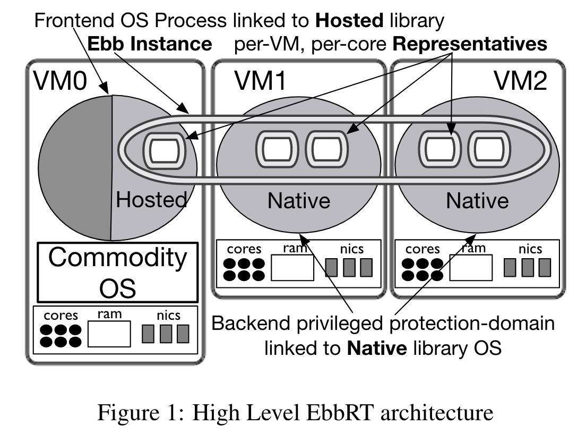
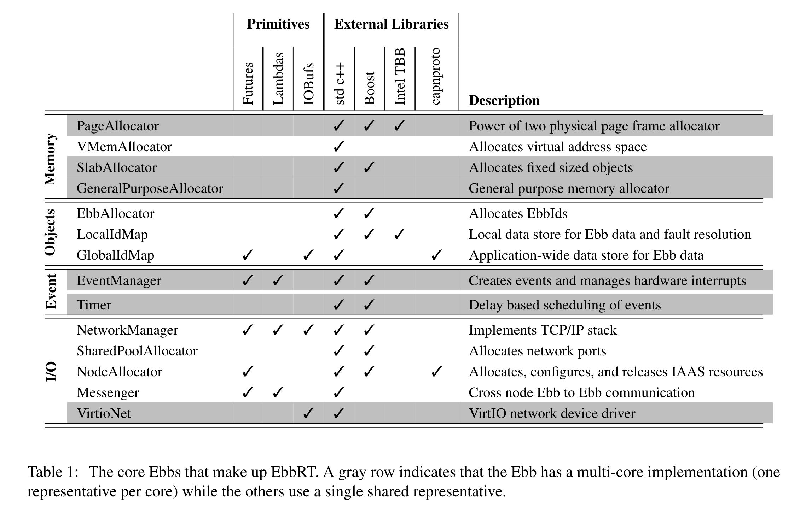

EbbRT 是一个 LibOS 框架，发表在 2016 年的 OSDI 会议。作者是来自 Boston University 的 Jonathan Appavoo 课题组。

这篇文章的 idea 非常有趣，但是文章内容写得并不够清晰，读完之后我对整个系统如何运行还有许多疑点，在 paper 中反复查找都没有找到说明。不过 EbbRT 的代码开源（[GitHub 链接](https://github.com/SESA/EbbRT)），不清楚的点总可以在 repo 里找到答案。（repo 的 doc 并不比 paper 全面，可能有些疑惑只有直接读代码才能解决了。）

---

## EbbRT 是什么？

EbbRT 是 Elastic Building Block Runtime 的缩写，它的目标是通过模块化的方式，让人们更好开发 Library OS。在这个出发点上它和 Unikraft 非常类似，不过他们的架构完全不一样。毕竟原文中我还有若干疑问没有搞清，所以我没办法直接讲一个 coherent 的故事来介绍 EbbRT。所以我决定通过列举 EbbRT 比较 nontrivial 的特点来介绍它。

首先我们 review 一下什么是 LibOS（详细的解释可以参考上一篇对 Unikraft 的介绍）。当代操作系统需要兼容各种各样的软件，而这种普适性是以牺牲性能为代价的。在 Infrastructure as a Service 时代，人们可以在云端服务器部署自己的服务，很多时候租一个服务器就只是为了 host 某个特定的服务。这时，general purpose 的 OS 就不再是必需品了，因为大部分功能可能都用不到。一个在云端取代 general purpose OS 的方案是使用 Library OS，也叫 LibOS。LibOS 是针对某个特定的 App 而定制的运行环境（也可以叫做 Runtime），只包含了该 App 所需的 OS 功能，从而大幅提升性能。在 COMPASS 公众号里，此前已经有过关于 Graphene LibOS、CubicleOS、Unikraft 的介绍，它们都是 Library OS 方向的工作。

##  EbbRT 的特点

EbbRT 相比于其他的 LibOS，有三个特点：
- Distributed
- Modular
- **Event-Driven**

### Distributed

EbbRT 并不是在单一机器上部署的，而是可以被部署在多个 VM 上（比如你在某个云厂商那里租了若干实例，可以用他们共同部署一个基于 EbbRT 框架的服务）。

架构图如下所示：

Commodity OS（比如 Linux）跑在其中一个 VM 上，其他每个 VM 上会运行一个 Native Library OS，这里 native 是指不依赖 OS 环境，直接运行在 hypervisor 中。EbbRT 的灵魂是 Ebb (elastic building block) ，每个 Ebb 负责提供一个细分的功能（memory allocation，networking 等）。Ebb 是一个抽象的概念，在每个 VM 的每个核上，都有一个 Ebb representative，提供该核上对应的功能。这些 Ebb 拼凑组成了 Native LibOS。

这些所有的 VM 上的 Native LibOS 共同 host 了一个应用程序。这个应用程序本身寄托于 Commodity OS 中的一个 process，其他的这些 VM 以及 Native LibOS 可以视为这个应用程序的加速器。

### Modular

EbbRT 从名字就可以看出它模块化的特点。上一段已经介绍了 Ebb 这个概念，这里放一张表格，里面列举了一些具体的 Ebb：

表格中每一行代表一个 Ebb，每一列对应一个 C++ 的功能或者 C++ 的库（EbbRT 基于 C++ 14）。灰色的行代表这个 Ebb 在每个 core 上都有一个 representative。

### Event-Driven

到目前为止，EbbRT 都没有什么很与众不同的，它真正有趣的点在于它的运行是 event-driven 的，而不是像 Linux 那样每个 process 运行一个 time slice 再由 scheduler 切换。

EbbRT 被设计成 event-driven 是因为大多数 cloud server 的运行逻辑是 event-driven 的：收到一个 request --> 处理它。在 EbbRT 中，每一个 Native LibOS 初始化后就会进入一个大的 Event Loop（one loop per core），不断处理新收到的 event。

这里 event 被分成三类：
1. hardware interrupt
2. execute-once event
3. reoccurring event

每一类 interrupt 都可以在 Native LibOS 中注册上一个 handler，在 event 发生时，这个 handler 便会被调用。其中 hardware interrupt 就是常见的硬件中断，比如网卡收到一个新的数据包时会产生一个中断信号。execute-once event 是为了弥补 event-driven programming 的不足：如果我想跑一段简单的顺序执行的代码，就需要注册这种特殊的一次性 event，等待 event loop 循环到它。reoccuring event 是需要周期性执行的任务，这些任务不由硬件产生信号，因此需要手动注册。

每一个 event 执行过程都是不可被打断的。在每个 event loop 中，Native LibOS 会首先打开 interrupt 功能，得到等待处理的 interrupts 后，关闭 interrupt 功能并处理它们；随后执行一个 execute-once event；依次调用 reoccurring events 的handler；重新打开中断功能并等待。

这种 event-driven 的设计省去了 linux 中 scheduler 所占用的时间，并且更契合 cloud server 的运行逻辑。

---

## 总结

EbbRT 为了证明自己的通用性，将 node.js 移植进了自己的框架，从而支持了一大批 JS 后端程序。他们 claim 这个移植是一个人在两周内完成的，因此工程量很小。在 paper 列举的性能测试中，EbbRT 最多可以达到相比于 Linux 2.8 倍的加速，不过更多情况下，EbbRT 只比 Linux 有一些微小的性能提升。

读完全文后，对我最大的启发还是 event-driven LibOS 的设计思路。但是读完 paper 后我其实不知道如何写一个 EbbRT 的 app：
- Syscall 是怎么被处理的？ （全文只有一处提到了 system call 这个词，但没有介绍如何响应 syscall）
- App 是如何调用 Ebb 的功能的？
- Ebb/Native LibOS 是如何受 Hypervisor 管理的？

这些问题可能还是得去他们的源代码中寻找答案。