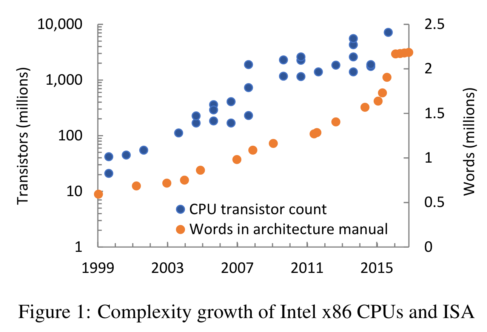
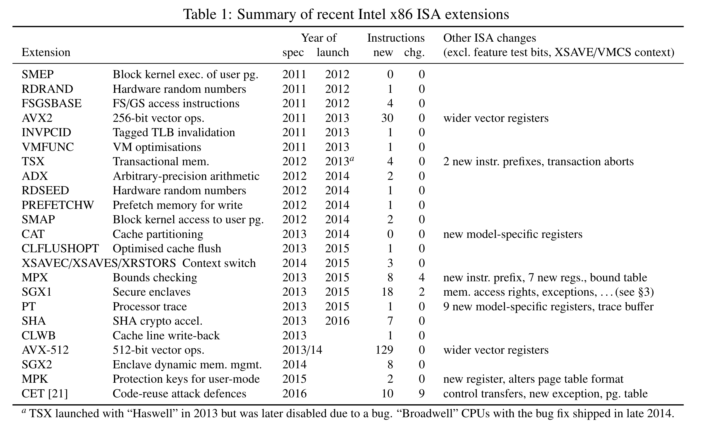

今天给大家带来的文章比较特殊，是来自 2017 年 HotOS workshop 的 *Hardware is the new software*，作者是来自微软研究院的 Andrew Baumann。这篇文章的标题已经非常犀利地表达了作者的观点：硬件是一种新时代的软件。

首先作者总结了当前的芯片行业行情，随着 Moore's Law 终结之日的接近，芯片厂商们必须认真思考一个问题：如果 CPU 性能没办法再大幅提升了，也没办法把更多的核塞进 CPU 了，我该如何继续卖芯片呢？卖家们为什么还会继续想升级 CPU 呢？

对这个问题，Intel 给出的答案是：让 CPU 提供更多的功能，比如安全性、特殊场景需求等。

但是提供更花样的功能使 Intel 面临一个问题：x86 已经足够复杂了，并且正在变得更复杂，而在电路上实现这么多花里胡哨的功能是一件很困难的事情。

作者列出了 2012 到 2017 年 x86 的 ISA 拓展，见表格：

这些拓展提供了包括随机数生成、虚拟化、安全性、Vector 操作、自定义原子操作（TSX）等，其中我们最熟悉的拓展就是 SGX1 和 SGX2 了。在可以预见的未来，Intel 还会继续提供更丰富的拓展。硬件正在变得像软件一样功能更加丰富。

接下来作者用了两个 Case Study 进行论证：SGX 和 CET（Control-flow Enforcement Technology）。

要在电路层面设计出 SGX 是一件过于困难的事情，为此 Intel 采取的方案是将电路实现和 ISA 设计解耦：使用 microcode 来实现 SGX。这里我们首先科普一下什么是 microcode：我们一般认为 ISA 是软件和硬件交互的接口，编译器生成的指令会被 CPU 一条一条地解读，并执行对应的电路逻辑。但是 microcode 是比 ISA 更底层的“软件”，一些特殊的指令（比如 SGX 相关的指令）实际上要拆分成更底层的一系列指令（micro-operation， μ-op），而“要如何拆分？”就是由写在 CPU 里的 microcode 决定的。形象一些理解，可以将 μ-op 看成真正的指令，microcode 是用这些底层指令写成的“函数”，而 CPU 执行特殊的指令实际上是在调用这些 microcode 函数。真正重要的地方在于：**这些 microcode “函数” 是可以出厂以后通过软件修改的**。也就是说，已经卖到了你手上的 CPU，里面的指令会如何执行，其实是可以由 Intel 来修改的。不过具体的实现 Intel 并没有直接公开，目前也有一些工作在对这些 microcode 进行逆向（如 https://github.com/chip-red-pill/MicrocodeDecryptor ）。此外，Intel 对此前的著名硬件漏洞 Meltdown 的 mitigation patch 也是以 microcode 的形式打到大家的 CPU 上的。

因此，SGX 某种程度上可以看成是一个“软件实现的硬件拓展”，并且论文中提到 Intel 对其实现使用 SMT solver 进行了形式化验证。而另一方面，硬件拓展可以替代软件实现一些功能，作者使用了 CET 来说明这一点。

CET 的两个核心技术是 shadow stack 和 indirect branch tracking。这些已经是 ROP 攻击防御的常用手段了，CET 的特殊之处在于它在硬件层面上实现了这两者。关于 CET 作者只是进行了一些科普，没有讨论实现，我在这里就不多讨论了，感兴趣的同学可以阅读原文。

综上，以 Intel 为例，我们可以看出硬件复杂度正在逐年增长，到了可以开始使用一些软件思路进行设计的地步。可以预料到以后的硬件设计范式可能会越来越像如今的软件设计。

同时，这也带来了新的问题：我们往往认为软件中到处是漏洞，而硬件相对而言是更可靠的。但是当我们开始像软件一样设计硬件的时候，我们要如何继续信任硬件呢？

