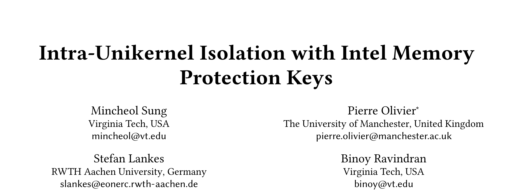
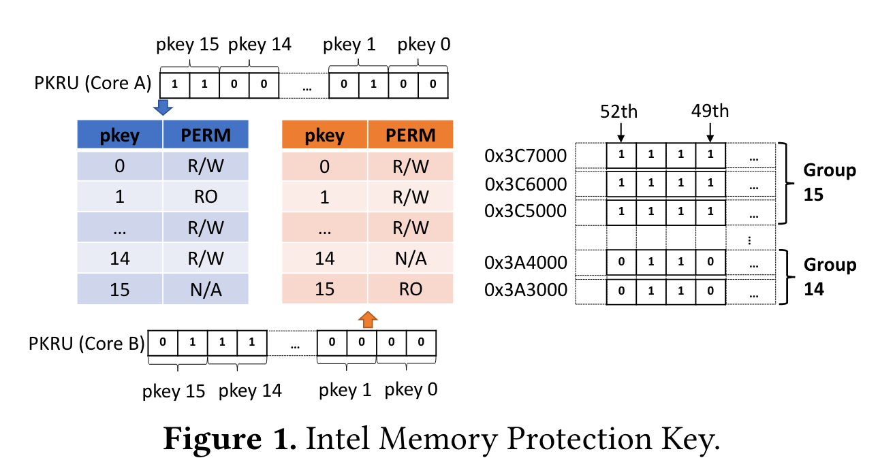

Memory Protection Keys (MPK) 是 Intel 在 2018 年引入的新硬件特性，利用 MPK 我们可以进行线程级别的页权限管理，并且无需修改页表配置。今天要介绍的文章发表在 2020 年的 VEE 上，它基于 RustyHermit 使用 MPK 提供了 Unikernel 内部的隔离来提升安全性。

---

## MPK

首先我们花一些时间介绍一下 MPK 本身，我阅读这篇文章的目的之一就是去了解 MPK 的机制原理。

MPK 的目标是提供每个 core 独立的内存访问权限管理。使用 MPK 之前，首先要将内存分组，最多分成 16 组。这 16 组的二进制编号 `0b0000 ~ 0b1111` 被称为 protection key。MPK 使用 x86 page table 中的 4 个 unused bits 来 label 分组信息：比如，如果这 4 个 bits 被设置成 `0b1001`，那么这个 page 就属于第 9 组。

分组之后，MPK 的使用就无需页表参与了。CPU 的每个 core 都有一个 32-bit 的寄存器（PKRU）来储存当前 core 对每个组的访问权限。PKRU 寄存器中包含 16 对 bit pair，对应 16 个 page group，每个 pair 包含两个 bit， 分别代表 R / W 权限。每个 pair 的取值对应三种可能的权限 (0, 0): read/write，(1, 0): read-only，(x, 1): no-access。如下图所示：

（注：尽管图中的 Group 15 和 Group 14 中 page 都是连续的，但是这并不是必须的。）

PKRU 寄存器可以通过 WRPKRU 和 RDPKRU 这两条指令来写入/读取。

到此为止 MPK 看起来很像 Arm 中的 TZASC 或者 RISC-V 中的 PMP。但是 MPK 和它们有一个重大区别：WRPKRU 和 RDPKRU 都不是特权指令！也就是说，在 ring 3（User space）中就可以直接运行这两条指令，来修改 MPK 的设置。

因为这个 PKRU 不是由特权指令读写的，MPK 能够提供的安全性其实是相当有限的，那要它还有什么用呢？MPK 的优点在于快，进行一次 PKRU 读写只需要 20 cycles 左右，相比进行一次 context switch 来说，PKRU 的切换非常快速。

因此 MPK 的目标并不是去防御尽可能多的攻击，而是以非常廉价的开销去防御一些特定类别的攻击。

---

## RustyHermit $\times$ MPK

RustyHermit 是一个使用 Rust 开发的 Unikernel，它支持运行其他语言开发的应用。Unikernel 可以看成一个 single application 的 OS，只有一个单一地址空间，没有特权等级。因此一旦 application 编写有漏洞，整个系统都会受到影响。比如一个 unikernel 中同时包含一个经过形式化验证的加密库，和一个用户编写的 HTTP parsing 库，后者包含的漏洞会让前者的精心设计毫无价值。因此，作者试图使用 MPK 来在一定程度上复原特权等级的设计，以此增强 unikernel 的安全性。

### 设计思路

这篇文章的思路其实非常直接：把 Unikernel 本身分成 trusted part 和 untrusted part：trusted part 主要包含 safe Rust（以及一小部分无法避免的 unsafe Rust），untrusted part 包含 unsafe Rust 和 application。Safe Rust，unsafe Rust 和 application 三者分别有自己的 data 段、stack 和 heap，分属于不同的 MPK page group。

Kernel 部分的 safe rust 中，调用一个 kernel 部分的 unsafe 代码需要经历以下步骤：
- 保存 stack pointer
- 切换 stack pointer 到 isolated stack
- 修改 MPK permission
- 调用 unsafe 代码
- 恢复 MPK permission
- 恢复 stack pointer

而 application 和 kernel 部分的隔离相对更加容易：syscall 函数调用前后进行 MPK 切换即可。（注：unikernel 中的 syscall 都是 function call，并没有特权等级切换。）

---

## Limited Security Guarantee

为了证明 MPK 带来了安全性提升，作者讨论了两种攻击场景：
- User / Kernel Space Isolation 能够阻断的攻击
- Unsafe / Safe Kernel Isolation 能够阻断的攻击

前者的场景中我们考虑一个包含 memory corruption vulnerability 的 web server，remote attackers 可以完成**任意读写**（例子：CVE-2013-2028 for NGINX，CVE-2014-0226 for Apache）。使用 MPK 可以让 RustyHermit 防御这类攻击。

后者场景中我们假设攻击者可以拿到 control flow，并且可以借此通过 syscall 触发有漏洞的 unsafe kernel 代码。通过 unsafe kernel 中的漏洞攻击者就可以完成任意读写、任意代码执行等。作者使用的案例是，攻击者通过篡改 per-core kernel variable 访问函数参数来实现任意读写。同样 MPK 可以防御这类攻击。

但是有一大类攻击是 MPK 不能防御的：任意代码执行。因为 PKRU 寄存机的读写并不需要特权指令，因此一旦攻击者有任意代码执行的能力，他就可以直接 disable MPK 功能。因此无论如何给 unikernel 设计，MPK 能够提供的防御都是相当有限的。

---

## Conclusion

综上，作者使用 MPK 给 RustyHermit 增加了一些安全保护，实验结果显示使用 MPK 带来的性能损失只有 0.6%。因此我们可以认为这篇工作用非常廉价的性能损失带来了针对特定类型漏洞的防护。但是面对任意读写漏洞（无论是 unikernel 自带的还是 application 中存在的），MPK 无法提供有效的保护。
