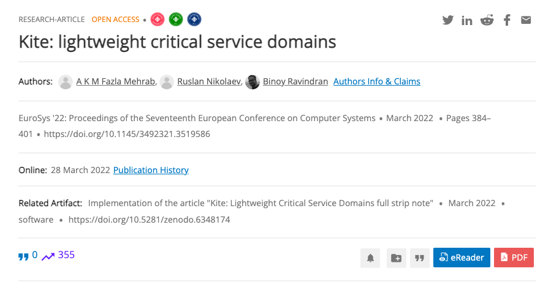
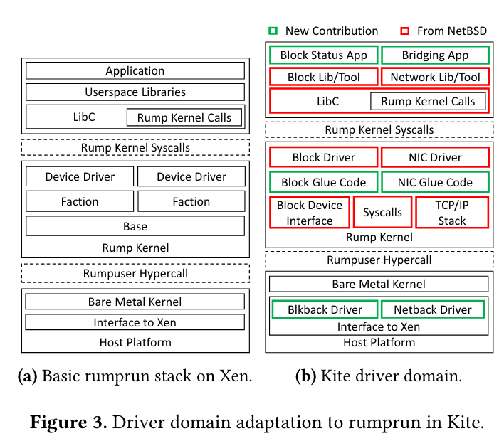
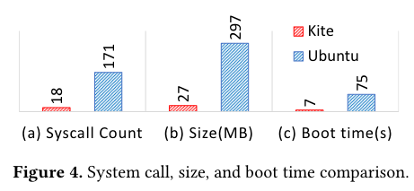
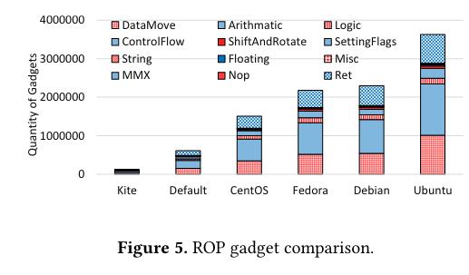

在论文分享系列中，我们已经介绍了几个不同设计的 unikernel（EbbRT、Unikraft、Theseus等），但他们的目标是一致的：为 user applications 提供运行所需的系统环境。在这篇文章中我们将介绍一个不同目的的 unikernel：用作 driver domains。

这篇论文发表在 EuroSys'22，作者来自 Virginia Tech 和 The Pennsylvania State University。

---

## Background & Motivation

在介绍这篇论文的 motivation 之前，我们先来了解一些相关背景知识，包括 Paravirtualization、Driver Domain 和 Rumprun unikernel。

### Paravirtualization & Driver Domain

半虚拟化（Paravirtualization）是 Xen 最先提出的提高设备虚拟化性能的方案（原文：[*Xen and the art of virtualization*](https://dl.acm.org/doi/10.1145/945445.945462)）。在 Xen 提出半虚拟化之前，Hypervisor 上运行的不同 OS 如果想要共同使用一个设备，一般 Hypervisor 会使用全虚拟化的方案。这时 Hypervisor 会禁用所有 OS 对设备的访问权限，当 OS 试图访问设备时，Hypervisor 就会自动得知访问事件以及访问相关的参数，经过检验后帮助 OS 完成访问。但这样做性能很差，因为任何一次对外设的内存操作都需要 trap 到 Hypervisor 内部，一条指令可以完成的事情必须要变成两次 context switch 加上 Hypervisor 内部的逻辑。于是 Xen 提出，可以假设 guest OS 知道自己是被虚拟化的，主动使用一套商量好的 protocol 来访问一个虚拟化的硬件，而不是用 native 的方式直接访问设备，这个协议被称为 virtio。

在 Xen 中，每个 guest OS 处于一个 domain（DomU），每个 DomU 中有一个 frontend driver。还有一个特殊的 domain（Dom0），在其中运行 backend driver。两者之间使用 virtio 通信。backend driver 则会调用真正的 physical driver 提供的 interface，完成实际的设备操作。换句话说，我们使用一个特殊的高权限 VM，来负责所有 VM 的 I/O 操作。

Xen 极大地提升了设备虚拟化的性能。但是使用 Dom0 的弊端也是很明显的：如果 Dom0 被攻破了，那么与所有设备的交互都将不再是安全的。为了解决这个问题，人们提出了 Driver Domain的概念：每一个（或一组）设备使用一个单独的 VM 负责，借助 PCI passthrough 直接访问设备，而不再使用 Dom0。此前的工作中，Qubes OS 和 SecureView 等使用了这个方案。

但是，将 Dom0 拆分成几个不同的 domain 并没有解决大部分问题：既然我们不相信 Dom0，我们又有什么理由相信拆分出来的这些 domain 呢？因此，作者认为，我们可以使用 unikernel 来更好地解决这个问题。
使用整个 OS 来 host 一个 driver，会不可避免地引入很多和 driver 自身功能无关的 attack surface。这些 attack surface 可以从两个方面衡量：对 driver 并不 essential 然而为了运行必须保留的 syscall、以及整个 VM 提供的 ROP gadgets 的数量。使用 unikernel 则可以将这两种 attack surface 都大幅降低。

那么接下来的问题就是如何使用 unikernel 来作为 device driver 了。大多数 unikernel 是为了 user application 设计的，所以不适合直接用于 device driver。并且想要保证对各种 device 的支持（比如网络方面 Ethernet 和 Wireless LAN，储存方面 PATA、SATA、SCSI 和 NVMe），如果不能利用现有的代码，工程量也是巨大的。因此作者采用了下面要介绍的 Rumprun unikernel。

### Rumprun

Rumprun unikernel 能够复用的 driver 代码来自 NetBSD，这得益于 NetBSD 的 *anykernel* 设计。NetBSD 中的 kernel components 全部都符合 *anykernel* 要求：加入一个叫做 Rump kenrel 的 glue layer 后，可以被直接拿去用在任意 context 下，比如可以直接将一个 driver 拿去跑在 user space 中。Rumprun unikernel 则是利用了 Rump kernel layer 构建的一个 unikernel，这样就可以在 unikernel 中复用 NetBSD 中的代码了。

## Design

讲清楚 motivation 后，这篇工作剩下的亮点基本就是 engineering effort 了。现有的 Rumprun unikernel 也并不是为 driver domain 设计的，因此缺失很多部分：没有 backend drivers、对 Xen Hardware Virtualization Mode 的支持非常初级等。因此，在现有 Rumprun 的基础上，作者们加入了对 driver domain 的支持，并命名为 Kite。

图中红色部分是直接复用 NetBSD 代码的部分，绿色则是新加入的部分。作者只实现了 network 和 storage 这两类 cloud server 最需要的 I/O 服务。

## Comparison

文中从不同角度对比了使用 Kite 和直接使用 Linux 作为 driver domain 的效果。

### Security

在 background 部分我们提到 Kite 主要从两个角度提升了安全性：减少需要的 syscall 和减少 ROP gadgets，下图是对比结果：

可以看到 Kite 减少了 10 倍 syscall 的数量，并且 ROP gadgets 数量也显著少于各大发行版。此外第一幅图还比较了 Image size 和启动时间，这两方面也是 Kite 更胜一筹。

### Performance

在性能方面 Kite 使用了 Nuttcp、Apache、Redis 和 MySQL 用于网络性能测试，DD、SysBench File I/O、SysBench MySQL 等用于储存性能测试。在所有的测试中，Kite 都和 Linux-based driver domain 表现出几乎一致的性能。

## Endings

这篇文章研究的问题很有趣，我们可以看到 unikernel 有除了 user application 以外的应用场景。其核心思路还是将模块化的代码组装起来用在特定场景，用通用性来换取安全以及性能。还有很多领域应该也存在并不需要通用性的情况，这些场景都可以考虑是否可以使用 unikernel 来进行优化。
