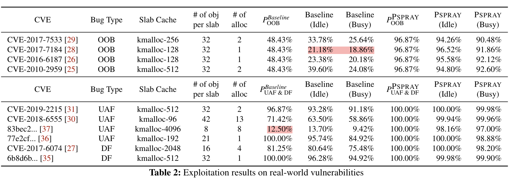

今天要介绍的这篇文章非常有趣，它把 side-channel attack 作为辅助手段，用于提高内存漏洞利用的成功率。文章中说他们是第一个使用 side-channel 攻击来利用内存漏洞的。这篇文章已经被 USENIX Security'23 收录，作者是来自 Seoul National University 的 Yoochan Lee、Byoungyoung Lee 等人。

## Motivation

在研究的 motivation 方面，作者首先 argue 了内核是攻击的重点目标之一，而对于黑客自身的隐蔽性来说，攻击的成功率十分关键，因为内核的漏洞如果利用失败，则可能会导致 kernel panic 等现象，从而使得黑客被发现。在现有的内核漏洞中，heap-based 漏洞是非常常见的一类，但是这一类攻击通常成功率并不能得到保证，这是由于

1. 攻击者无法得知当前内核 memory allocation 的状态；
2. 内核 memory allocation 有一定的随机性，攻击者无法预测。

比如说，最常见的 heap-based 漏洞 Out-of-bound（OOB）、use-after-free （UAF）以及 double-free （DF）都要求 vulnerable object 和 target object 相邻或重叠，攻击者往往只能通过多次尝试碰运气来触发这样的情况。

但是如果攻击者可以通过 timing 信息获得当前 kernel heap 的 allocation 状态，情况就不一样了，这就是这篇文章的攻击思路。

## The SLUB Allocator

Linux kernel 使用 SLUB Allocator 作为 heap allocator，比如当我们在内核中使用`kmalloc`函数的时候，就会从 SLUB Allocator 中申请到内存。与 user space 调用 `malloc`不同，内核中需要申请的对象相对比较固定，大部分情况下是一些编译期确定的常见的结构体，SLUB Allocator 正是利用这一点被设计出来的，它尽可能地利用到了 cache，从而提升了内核的性能。

下面简单介绍一下 SLUB Allocator 的结构：

- 针对每个常见的 allocation size， SLUB 设置了一个 `kmem_cache`，比如`kmalloc-96`、`kmalloc-128`、`kmalloc-sizeof(task_struct)`、`kmalloc-sizeof(mm_struct)`等；

- 对于每个 `kmem_cache`：

  - 每个 CPU 对应一个 `cpu-freelist`、`page-freelist` 和 `partial-freelist`。每个 `page-freelist` 有一个 slab，每个`partial-freelist`有一个或多个 slab。

  - 每个 node 对应一个 `partial-freelist`，包含一个或多个 slab。

从 allocation 过程中就可以很好地理解这些结构是用来做什么的了：

- Fast-path： 在 allocation 中，SLUB Allocator 首先在 CPU 的 freelist 里寻找内存，如果还有空闲内存则直接返回，这条路径被称为 **fast-path**；
- Medium-path #1：fast-path 未成功，说明 freelist 中已经没有空闲内存了，那么直接将该 CPU 的 pagelist promote 成 freelist，再从 freelist 中 allocate memory；
- Medium-path #2：Medium-path #1 未成功，说明该 CPU pagelist 是空的，那么将该 CPU 的 partial list 中一个 list 变为 freelist；
- Medium-path #3：Medium-path #2 未成功，说明 CPU 的 partial list 也空了，那么从 node 的 partial list 中拿一个作为 pagelist；
- Slow-path：此前所有的尝试都没有成功，这时候就需要从 Buddy Allocator 中拿新的 page 出来，填充 SLUB Allocator，再进行 allocation。这条路径显著慢于之前的路径，因此我们将它称为 **slow-path**。

为了增加安全性，内核提供了一个`CONFIG_SLAB_FREELIST_RANDOM`选项，在 fast-path 中增加随机性，allocation 时从 list 里随机取出一个 free element。这样攻击者就无法轻易操控 allocator 的状态，从而构造 OOB、UAF、DF 等。

## Russian Roulette

在`CONFIG_SLAB_FREELIST_RANDOM`开启时，攻击者发动攻击可能会成功，也可能触发 kernel panic。下面给出了 OOB 攻击的成功、失败案例示意图：

OOB 攻击中，攻击者先 allocate 一些 target object，只要成功 overwrite 其中一个，就可以成功发动攻击。可以看到只有 vulnerable object 刚好在某个 target object 左边（低地址）的时候，才能发动攻击。失败的原因可能是 allocation 过程中的随机性，或是正好 CPU 启用了一个新的 freelist。UAF、DF 的情况类似，示意图就不在此展示了。

作者进行了一些简单的数学计算，得出三种情况下成功的概率分别为：
$$
P_{OOB}=\frac{N-1}{2N},\\\
P_{UAF,DF}=
\left\\{
\begin{aligned}
\frac{N-A+1}{N}, A < N,\\\
\frac{1}{N}, A \le N,
\end{aligned}
\right.
$$
其中 $N$ 是一个 freelist 中 object 的数量，$A$ 是一次 UAF/DF 攻击中伴随的 Additionally allocated object 的数量（上面介绍中未直接提及，请参考原文）。

## Timing Side-Channel

其实攻击的思路是非常直接的：如果我观测到一次 slow-path，说明所有 list 都是空的，这时候 allocation 状态对我来说是相对更清晰的，更容易发动攻击；而 slow-path 需要经过一次 buddy allocator 的算法，速度是显著变慢的，也最容易观测。

具体操作上，作者首先要找到合适的 syscall，于是他们用 Syzkaller kernel fuzzer 来筛选出符合三个条件的 syscall：

1. 可以在用户态随便调用
2. 只 allocate 一个 object（否则更难以观测哪个 path 被使用了）
3. 除了 allocation 外没有其他显著的 performance overhead

经过筛选后，作者为从`kmalloc-32`到`kmalloc-8192`每个 size 都找到合适的 syscall：

这里简单看一下测量结果：

图中红色的叉为 slow-path，可以看到辨识度还是很高的。

观测到一次 slow-path 后，可以这样进行 OOB 攻击：

1. 既然观测到了 slow-path，说明有一个新的 slab 被创建，并且其中正好有一个 object；
2. 故意再 allocate $N-1$ 个 objects 把这个 slab 填满；
3. 这时候如果再allocate，则会主动触发 slow-path 再次新建一个 slab。这时候我们 allocate $N-1$个 target objects；
4. allocate 一个 vulnerable object 填满这个新的 slab。

这时候除非 vulnerable object 正好是 list 最后一个，否则攻击都能成功。因此这时候概率为 $P_{OOB}=\frac{N-1}{N}$。用类似方法使用 PSPRAY 进行 UAF、DF 攻击，理论成功率则是 $100\\%$。

## Evaluation Results

作者先对每个 kmalloc size 进行了测试（所有实验都基于 Linux v4.15，大概是有很多已知的 heap-based vulnerability）：

图中可以看到实际测量值和理论值有偏差，尤其是 OOB 中。这是因为除了攻击者在进行 allocation 外，系统本身在进行活动，不可避免地有 noise 导致偏离预期。但是无论什么情况下，使用 PSPRAY 的成功率都接近 $100\\%$。

接下来作者对 real-world vulnerability （CVE）进行了测试：

其中 idle 代表系统中只在运行 PSPRAY 进程，busy 代表了除了 PSPRAY 外，还跑了很多 stress-ng 进程，来模拟更加杂乱的真实攻击过程。可以看到有一些漏洞在系统 busy 时，只有不到 $10\\%$ 的成功率，这些漏洞以往可能会被评估为相对没有那么危险的漏洞，但是在 PSPRAY 的辅助下，都达到了接近 $100\\%$ 的成功率。

最后，在防御方面，作者提出的方案是给 slow-path 增加随机性，复用 freelist index 的随机设计，触发某个 index 的时候就看看 partial list 是不是空了，要不要走 buddy allocator，而不是等到 CPU freelist 用光再逐级检测这些 list 是否为空。他们只修改了 13 行 kernel 代码就将 PSPRAY 的成功率降低到了基准线。

## Conclusion

这篇文章的思路其实理解起来很简单，类似的方向应该还有很多可以发挥的空间。这篇文章证明了：

- side-channel 可以不直接用于攻击，而是辅助一些低危漏洞将他们 promote 成高危漏洞；
- 再次验证了 Optimization-Leakage trade-off，使用 cache，无论软件硬件，都要小心信息泄露。

