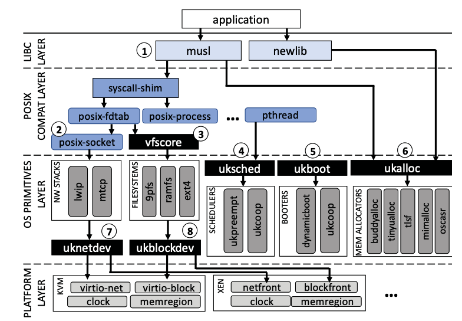
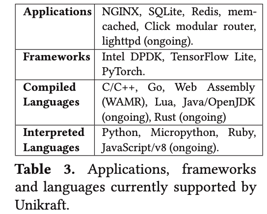
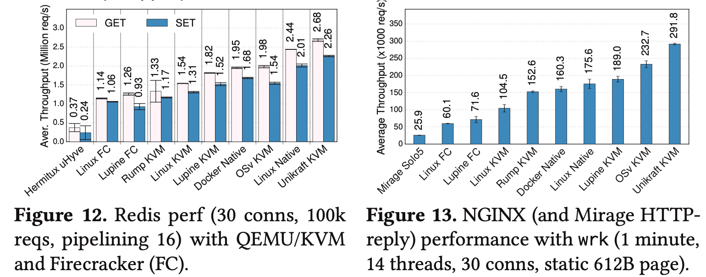

原先计划今天分享的是 SOSP'17 的 *My VM is Lighter (and Safer) than your Container*。后来发现了 EuroSys'21 的同一个领域的新文章，并且看起来更有可能跟我在研究的课题产生关联，因此决定改成分享这一篇。这篇论文是一个工业界项目（Unikraft）的副产品，Unikraft 本身已经开始被用于业界生产环境（官网链接：https://unikraft.org ）。

## 什么是 Unikernel？

Unikraft 是一个高度模块化的 unikernel 构建系统。原文假设作者已经对 unikernel 有所了解，但这一概念对大部分人来说还相当陌生。因此，在进入主题之前，我们先介绍一下什么是 unikernel。而在介绍 Unikernel 之前，让我们首先回顾一下 kernel 是为什么而生的。

在远古时代，计算机只是用来辅助计算的工具，计算机上跑的是一些特定的计算任务，给定一些输入，得到一些输出，这个过程非常朴素。操作系统的诞生来自于共享硬件的需求。当几个人希望同时使用一台硬件设备、或者一个人希望同时运行多个计算任务的时候，就需要一个更高权限的管理员来统筹调度，按照一定的规则来给每一个 task 分配资源。

如果一台设备上只是运行少数几个 tasks，那么只需要一个简单的管理员进行 brute-force 的资源分配就可以了，这甚至可以通过人工管理员手动来完成。然而随着硬件能力的迅速发展，一台设备上只运行少数几个 tasks 变得非常不划算，对 tasks 数量 scalability 的需求急剧增长，这时候就不能再使用简单的方式进行资源分配了，对操作系统的需求应运而生。操作系统中的 kernel 就是资源的管理员。

对操作系统的研究与讨论中诞生了虚拟化这个概念。虚拟化极大地简化了资源分配的过程，于是有了 *The art of operating system is the art of virtualization* 这种说法。市面上也出现了各种各样、各具特色的操作系统。针对不同需求，有时候需要选择不同的操作系统。

随着硬件能力的进一步发展，类似的 pattern 又一次出现。对于一个计算能力强大的服务器而言，在其上只跑一个操作系统显得十分浪费，于是诞生了各种 hypervisor，使得一个机器上可以跑多个操作系统。在这个时代，人们可以租到云服务器，拥有一个自己的操作系统，在其上 host 各种服务，与成百上千个用户共享同一套底层的硬件。

随着时代进一步发展，人们发现用云服务器非常的不方便：性能上限太低，下限太高。上限太低使得服务器无法很好地处理爆发式的大规模请求；下限太高使得闲置的服务器也需要收取不菲的费用。这时候出现了 serverless 的概念，用户提供自己希望运行的函数，在它每次需要执行的时候，开启一个 container，执行完成后就将 container 删除。这样没有请求时就不会被收取费用，而有爆发请求时也可以很好地处理。Linux 提供了 LXC 技术来使得不同的 container share 同一个 kernel，然而 share kernel 必然带来安全隐患，因此目前大部分厂商的架构里，每个 container 都有一个自己的 kernel，从这个角度而言，一个 container 更像是一个 VM。

然而站在这个角度回头看 kernel 最初的 motivation 就会发现奇怪的地方：如果一个 container 的整个生命周期都只为一个 task 甚至一个函数服务，那么 why do we ever need a kernel in the first place？答案是我们实际上不需要 kernel，至少不需要一个完整的 kernel。但是 modern software 从开发到部署整个过程都高度依赖目前世界上已有的软件抽象（或者叫：“环境”），回到远古时代的软件编写模式并不现实。那么有没有一个解决方案，让我们既可以 host 目前 kernel 上可以 host 的 applications，又可以抛弃掉 kernel 中那些不必要的部分呢？ 这个问题的答案就是 unikernel。

一个 unikernel 包含一个 application 以及运行这个 application 所需要的自上而下的所有环境，包括标准库、协议栈、设备驱动等等。舍弃了不需要的部分使得 unikernel 的 image size 更小，运行速度更快。比如一个基于 UDP 协议的服务器就不需要一套 Linux 中完整的网络协议栈。

然而此前的 unikernel 面临着以下问题：

- 为了达到高性能，需要为每个不同的 application 做定制，但是这些定制中又经常包含重复的部分。
- Unikernel 经常不兼容 POSIX，使得 application 本身也需要进行大量的移植工作。

Unikraft 的出现解决了这些问题，它的设计中包含了以下两条核心思路：

- Kernel 应该完全模块化，这样 unikernel 才会高度可定制。比如传统 OS 可以分成 memory allocator, scheduler, network stack, filesystem, device drivers 和 early boot code 等。
- 每个模块提供的 API 应该经过精心设计，从而达到很高的 performance。并且同一类模块要实现同样的一套 API，以达到可以随意替换的目标。

## Unikraft 的结构

沿着两条核心思路，unikraft 采用了以下一些 design decisions：

- Single Address Space
- Fully Modular System
- Single Protection Level（没有 User mode / Kernel mode 的划分）
- Static Linking
- POSIX Support
- Platform Abstraction

如下是 unikraft 的架构图：

Unikraft 遵循 *Everything is a micro-library* 的原则。图中每个黑色的方块，代表的是一套 API，除此之外每个小方块代表一个 library，处于同一个白色方框中的方块可以互相取代。自上而下比较重要的组件有：

- 经过若干个小 patch 移植的 libc，比如 musl 和 newlib，
- syscall-shim：将 syscall 变成 function call，实现 kernel bypass 提升性能，
- 其他提供 posix 标准的 library，
- 网络协议栈，比如 lwip、mtcp，
- 文件系统，比如 9pfs，ramfs，
- 调度器，
- Booter，
- 内存分配器，比如 buddy allocator，
- 不同 hypervisor 平台需要的 driver，

其中只有 Booter 是每个 application 都必须使用的，其余的模块都是可选的。

## 兼容性

对于有 source code 的 application，并且假设 application 中所有的系统调用都是通过合适的 POSIX 标准函数调用的，那么 unikraft 会通过 syscall-shim 层将这些函数替换成自己实现的 syscall handlers，从而使得 syscall 变成了简单的 function call。在此前的工作也有通过动态翻译实现 syscall 的，为了测试性能，unikraft 也提供了这种支持。

经过测试，在 Linux 中，一次 syscall 带来的 overhead 在 154 个 cycle 左右，而如果加入了一些针对 vulnerability 的 mitigation，则需要 222 个 cycle。动态 syscall 翻译的 unikraft 需要 84 个 cycle。而使用 syscall-shim 的 unikraft 中，syscall 和普通的 function call 一样，只需要 4 个 cycle。

然而不提供 User mode / Kernel mode 的隔离肯定会带来安全问题的考虑，unikraft 给出的 argument 是，VM 之间的隔离应该由 hypervisor 提供。这个 argument 听起来并不够 strong，因此也产出了 SGX 上的 CubicleOS（ASPLOS'21）这样的工作，它使用了 unikraft，在 SGX 中保证了不同 component 之间的隔离性。

在 paper 完成之时，unikraft 已经支持了 146 个 syscall，到现在应该支持了更多。而根据已有的科研工作，只需要 100 ~ 150 个 syscall 就已经能够运行很多主流的应用程序[1-2]。

以下是 unikraft 支持的应用及语言：

在指令集架构方面，目前 unikraft 已经提供了 x86 支持和部分平台的 arm 支持，暂时还没有对 RISC-V 的支持。

## 性能

由于 unikraft 进行了 kernel bypass，没有 syscall overhead，一个应用使用 unikraft 后也可以在 linux userspace 跑。而一个应用被放进 unikraft 后，会比它本身直接在 linux 运行后更快。

下图是运行 Redis 和 Nginx 的性能比较：

## 一些思考

最近了解到不少颠覆传统 OS 架构的工作。Linux 这样的大型项目虽然好用，但是已经开始在很多方面不契合这个时代最前沿的需求，类似这样的工作将会越来越多。除此之外，本文对 OS 模块化的方式以及 API 的设计很有参考价值，或许可以用到我们自己的科研项目中来。

---

[1]. Pierre Olivier, Daniel Chiba, Stefan Lankes, Changwoo Min, and Binoy Ravindran. A binary-compatible unikernel. In Proceedings of the 15th ACM SIGPLAN/SIGOPS International Conference on Virtual Execution Environments, VEE 2019, pages 59–73, New York, NY, USA, 2019. ACM.

[2]. Chia-Che Tsai, Bhushan Jain, Nafees Ahmed Abdul, and Donald E. Porter. A study of modern linux api usage and compatibility: What to support when you’re supporting. In Proceedings of the Eleventh European Conference on Computer Systems, EuroSys ’16, New York, NY, USA, 2016. Association for Computing Machinery.

