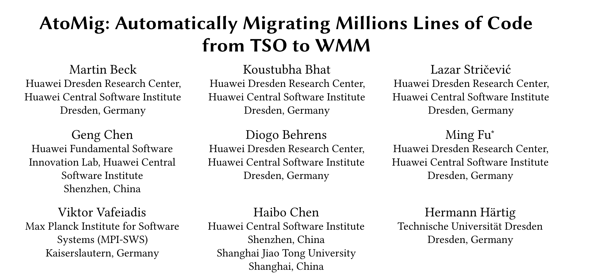
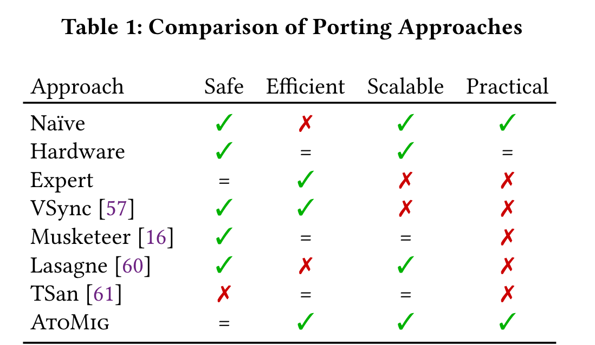
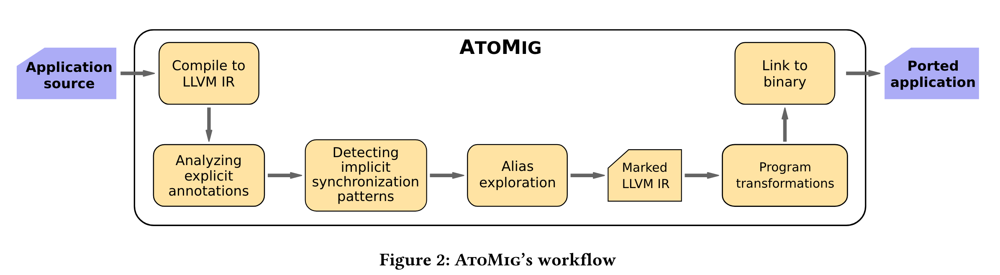
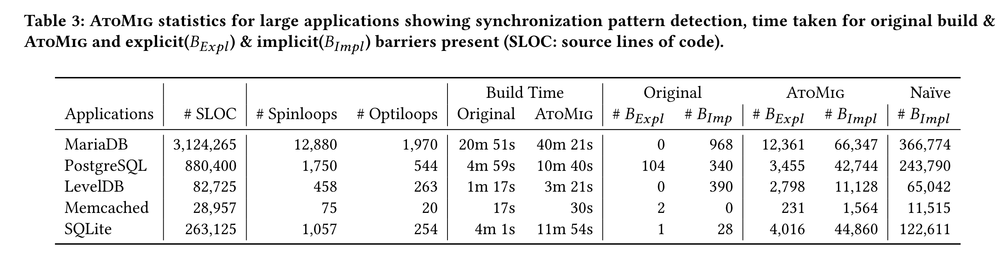

在此前的论文分享中，介绍过《Formal Verification of a Multiprocessor Hypervisor on Arm Relaxed Memory Hardware》这篇文章，其中提到了 Arm 使用的 Weak Memory Model（WMM） 与 x86 使用的 TSO 的区别，以及这种区别带来的 bug。当时我们提到，TSO 是一种更强的 memory model，比如它不允许不同地址的 store-store reorder，而 WMM 则没有这种限制。如今 Arm 和 RISC-V 架构的市场份额正在逐年上升，也有越来越多的 x86 程序在被移植到 Arm 和 RISC-V，因此这种差异性开始受到重视。当需要移植的程序使用了标准库之外的同步机制时，移植就不只是换一个 target platform 这么简单了，还需要手动插入一些 memory barriers 从而防止 WMM 与 TSO 差异性带来的 bug。

人工操作不仅成本高，还容易出错，因此我们需要一种自动化的移植方案。AtoMig 就提出了一种从 TSO 迁移代码至 WMM 的方案。这篇文章的作者来自德国的华为研究中心、马普所、Dresden 科技大学和上海交大。文章收录于 ASPLOS'23。

## 为什么需要 automatic migration ？

在开头部分我们已经部分介绍了本文的 motivation：

- WMM 限制弱于 TSO，使得简单移植的程序可能有漏洞。
- 漏洞需要 memory barrier 来解决，而 memory barrier 的插入依赖较深的专业知识，并不是大部分程序员所了解的。
- 如果移植时处处插入 memory barrier，就会让 memory model 强化成比 TSO 还要强的 SC（sequential consistency）模型，这样的程序虽然没有错误，但是性能会显著下降。
- 即使是专家做移植，也可能会有疏漏。
- 基于 WMM 的 CPU 市场份额在增大，未来有更多的程序需要移植。

综上，我们需要一个自动化的 TSO 到 WMM 的代码移植方案。

## 有哪些现有的解决方案？

上图总结了现有的移植方案，其中绿勾代表满足，红叉代表不满足，而等号代表部分满足。总结为以下几条路:

- Naive: 思路非常简单，即刚刚提到的，insert barrier everywhere，从软件上恢复 SC，缺点是性能比较差。
- Hardware: 硬件上同时支持 TSO 和 WMM，使用系统控制寄存器来开关 TSO。这条路的代表是苹果，M1 芯片运行 x86 代码时，除了使用 Rosetta 2 的动态二进制翻译，还需要打开 TSO 模式，防止  memory model 导致的漏洞。
- Expert: 专业人士手动移植，是事实上现有的主流方式，缺点是成本高，无法大规模使用。
- 形式化方法: 可靠、安全但是代码量不能 scale up，并且往往依赖人工写入的 annotation。
- 插入 Barrier: 生成程序的 abstract event graph，并插入 barrier。同样无法 scale up。
- 移除 Barrier: 先处处插入 barrier 得到符合 SC 的程序，再将不必要的 barriers 移除。缺点是只支持一部分 x86 指令集。
- 动态 Race detection: 依赖测试用例的覆盖率，需要广泛的用户测试。

而本文提出的 AtoMig 则着重于实用性，基于现有的技术，在 verified scalable approach 还没有出现的时代，自动化地尽可能使得移植可靠。

## AtoMig

下图是 AtoMig 的结构图:

AtoMig 基于 LLVM 实现，重要部分为 (1) explicit annotation analysis，(2) implicit synchronization pattern detection，和 (3) alias exploration.

Explicit annotation analysis 针对三类明显的 annotation：volatile、atomic 和 inline assembly。作者将这些代码都改为 SC 的 atmoic 访问。

更复杂的是没有明显提示的 concurrent 访问。对于这部分，AtoMig 的 implicit synchronization pattern detection 重点关注 spinloop detection，因为根据现实经验，这是最容易在 TSO 到 WMM 迁移过程中出现 bug 的地方。AtoMig 将检测到的部分也都转化为 SC 的 atomic 访问。

最后，alias exploration 用于检测除了 spinloop 之外的 concurrent 原子性访问。作者通过 type system 来实现这部分检测。

## 用于 Real-world 应用

为了检验 AtoMig 的正确性，作者首先在小代码量的标准库中同时用 AtoMig 和形式化方法做移植，来对比结果。

此后，作者将 AtoMig 用于了一些 real-world application（代码量都很大）移植，结果如下：

其中最后三列对比了 memory barrier 的数量。可以看出 AtoMig 自动化插入了很多 barrier，但是并没有 naive 那么多，从而节省性能的同时完成较为可靠移植。

实验过程中，他们还发现了 MariaDB 中一个被错误修复的 bug。

## Conclusion

这篇文章的 motivation 非常棒，指出了一个未来可能会很常见的隐患，并综合现有的技术做出了一个重视实用性的工具。同时，本文的局限性也很明显：这篇文章并没有提出什么根本性的技术突破，而是在各方权衡中找到了一种现有的可行的方案。即使使用了 AtoMig，也无法确保得到的应用程序不会出现 WMM 带来的 bug。这个研究方向还没有被彻底 kill 掉。