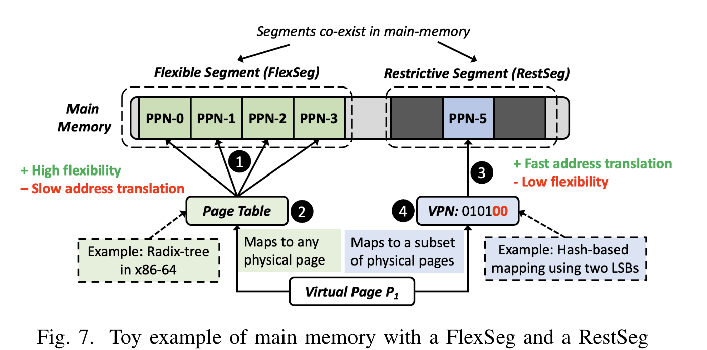
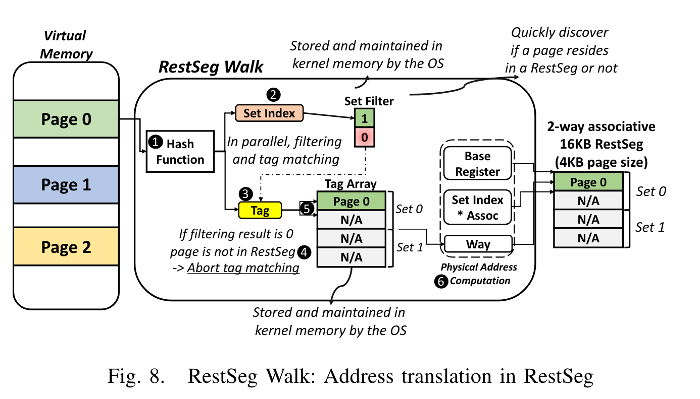
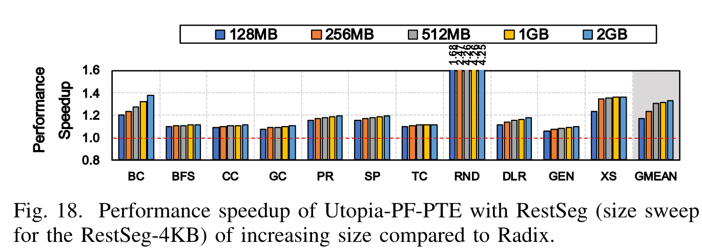

此次分享的论文是一篇 arXiv 预印本。作者中有熟悉的名字 Onur Mutlu 所以觉得质量有所保证，实际阅读后也的确有所收获。Mutlu 的工作擅长于发现现有体系结构中不必要的开销，并想办法从根源上优化它，比如他持续关注的 in-memory computation 领域。这次要介绍的工作也遵循这个思路，作者发现当代处理器中页表设计对数据密集型程序其实并不友好，在各种模型满天飞的时代，有必要重新思考 page table 的设计了。于是这篇文章提出了一种新的 page 映射方式。

## 背景：page table 其实也很耗性能

当代处理器使用 MMU 提供物理内存的虚拟化，可以使用 page table 作为 metadata 来储存虚拟地址到物理地址的映射。这个我们十分熟悉的过程实际上背后也有很多细节。比如 TLB miss 的时候，MMU 是如何访问 page table 的呢？直接从 DRAM 读还是从 cache 里读？实际上作为 CPU 内部的单元，MMU 也需要通过 cache 来读取数据，所以 page table 会被先 load 到 cache 里。这种传统的设计其实有两大缺陷：

- 高延迟。以常见的 4 级页表为例，TLB miss 并且 cache miss 时，需要触发 4 次串行的 DRAM 访问。实验显示尽管采用 TLB、PWC（page walk cache）技术，地址转换依然占据整个 execution latency 的 50%。
- 高缓存占用。依然以 4 级页表为例，页表本身作为 meta data 也需要占据 cache 和内存，这部分 cache 本来可以用于储存计算所需的 program data，此外，对 page table 的 DRAM request 还会频繁触发 DRAM row buffer conflicts（DRAM 内部的性能开销）。实验显示，在 data-intensive 程序中，有 53% 的 L1 cache 用于了储存 page table，并且相比于一个有完美 TLB 的系统，page table DRAM request 使得 DRAM row buffer conflicts 上升 24%。

这些非常 solid 的实验数据证明了现有的 page table 设计确实还有优化空间。除了上面提到的几个最 impressive 的数据，文章使用了大量图表来论证这个 research motivation，感兴趣的同学可以去参考原文。实际上已经有一些现有工作进行优化，比如使用 hash table 来储存页表映射，但是其弊端是无法在不同的 address space 直接进行共享，从而降低了内存利用率。

## 混合方案

作者们结合了现有的方案，把物理内存分成两种 segments：

- restrictive segments（RestSeg）：使用 hash-table based 机制加速地址转换，但是只适用于特定的物理地址；
- flexible segments（FlexSeg）：可以覆盖所有物理地址，类似原有的 page table 机制。

基于这种混合设计，就可以在不失去通用性的前提下实现性能优化。

下面重点介绍一下 RestSeg 中的映射：

首先 virtual page number（VPN）经过一个 hash function 得到一个 set index 和一个 tag。接下来对 set index 和 tag 的处理可以并行，相比于 4 级页表的 4 次串行内存访问是一次加速。首先去 set filter（一个 OS 管理的数据结构）中寻找 set index 处的值，如果结果为 0，说明这个 page 不在 RestSeg 中，终止此次翻译。如果结果大于 0，那么再根据 tag 去 tag array（另一个 OS 管理的数据结构）中寻找对应的 entry，这个 entry 记录的信息被称为 the number of way（因为 RestSeg 的设计使得 tag array 正好 match cache way，可以提升性能）。最终的物理地址就是$BaseRegister+set\ index\times associativity + way$。

此外文中还 propose 了一些方式来自动化的识别哪些内存适合用于 RestSeg，以及如何配合 FlexSeg 实现跨进程数据共享，但都相对比较普通，这里就不做介绍了。

## 实验结果

在 11 个 data-intensive workload 中，Utopia 使得性能平均提升了 32%（单核），而此前的类似工作只能做到 24%。而这一性能提升只需要 0.74% 的 area overhead（芯片面积）和 0.62% 的功耗增长。

## 讨论

这篇文章给我带来最大的启发是，如果能找到一个被常规设计隐藏的缺陷，就对症下药可以做出好的设计。这一点对于硬件和软件应该同样适用。在阅读本文之前，我从没有想过 MMU 会对程序运行有如此大的开销，并且这些开销是可以通过设计避免的。OS kernel 等软件中或许也存在类似的缺陷可以挖掘。