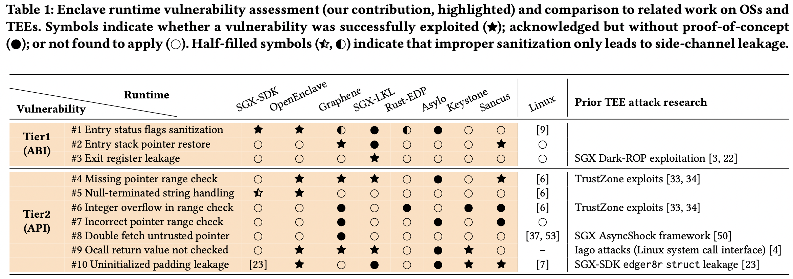

今天分享的是一篇关于 TEE runtime 安全的论文，发表在 CCS'19，作者来自于 The University of Birmingham (Flavio D. Garcia, etc) 和 KU Leuven (Frank Piessens, etc)。

---

TEE 技术希望在操作系统可能被完全攻陷的情况下，依然保持用户程序的安全，主要途径是通过一些硬件原语来实现一个隔离的、受保护的执行环境（被保护的 domain 被称为 enclave）。目前主流的 TEE 技术分为两类：使用 single-address-space model 的（比如 SGX、Sancus）和使用 two-world view 的（比如ARM TrustZone 和 Keystone）。但是不管使用什么样的模型，程序执行总是需要输入和输出的，这就意味着 enclave 总会需要通过一些机制和操作系统交互，这些交互使用的 interface 也可以成为针对 enclave 的 attack surface。

不同 TEE 设计下，与操作系统交互的 interface 截然不同，这使得编写 Enclave Application （EAPP）变得 platform-dependent，需要开发者拥有足够的 TEE 背景知识。为了让 TEE 能够运行更广泛的 EAPP，学术界和工业界产出了许多 Enclave Runtimes，比如 Graphene-SGX，可以支持运行 unmodified Linux ELF （甚至是动态链接的！）。而这带来的代价便是，我们需要将这些 Runtime 算进 enclave 的 TCB 内。因此，这些 Runtime 本身的安全是至关重要的。

这篇文章总结了 10 种 enclave 与 操作系统交互时可能出现的 vulnerability，并审计了以下 Enclave Runtime 的代码，在每一个 Runtime 内都找到了对应的 vulnerability：SGX-SDK, OpenEnclave, Graphene, SGX-LKL, Rust-EDP, Asylo, Keystone, Sancus。

下面我会简要概括这 10 种 vulnerability，它们的细节我并不会在这里讨论，有兴趣的同学可以参考原文。

## 第一大类：Application Binary Interface (ABI) Level

10 种中的前三种是 ABI level 的vulnerability。我们首先 review 以下什么是 ABI。在编写软件时，我们更常见的是 API （Application Programming Interface），比如我们使用了某个 library，它向外暴露了一些函数，这些函数可以在我们自己写的程序中被调用。但是对于操作系统这样的软件，向外提供接口的方式并不是暴露自己的函数，而是给定一个统一的入口，通过输入的参数来判断需要提供什么样的功能，比如异常向量表、中断向量表。ABI 通常出现在不同特权等级的软件之间（比如 User program 和 OS kernel、OS kernel 和 Hypervisor），或者调用者和被调用者耦合度很低的情况下（比如 OS 和 Enclave、或者 OS 和一个封装度很高的外设 driver）。

由于 enclave 的隔离性，OS 对 Enclave 函数的调用并不会直接将 control flow 交给 enclave 中的函数，而是先跳转到实现设定好的 Enclave entry point，经过一段 prologue，再开始 enclave 重要逻辑部分代码的执行。这段 prologue 在一些 TEE 中可能是主要依赖软件实现的，也可能是利用硬件辅助的。这段 prologue 应该负责合理设置机器状态，从而安全地进入 enclave 执行。但是如果 prologue 的审查并不充分，就可能留下 vulnerability。

### #1.Entry Status Flags Sanitization

> Entry code should sanitize register flags that may adversely impact program execution.

这里作者主要针对 SGX 进行了分析，使用 #AC 和 #DF 两个寄存器作为例子。#AC （alignment check）寄存器会在访问地址没有对齐时产生 fault，使用这个寄存器，可能会导致 side channel 的信息泄露（比如可以看到 enclave 的内存访问 pattern）。x86 还支持了一些字符串操作指令（比如 `rep movs`），而 #DF 寄存器设置了字符串处理的方向是增长的还是减少的。比如在 `memset` 操作中，如果我们反方向设置了 #DF，可能会导致清零了一些关键数据使得 memory 出现 corruption，而真正该被清理的数据可能并没有被清理，导致内存泄漏。

因此，如果 enclave runtime 在进入 enclave 前没有合适地检查、设置这两种寄存器，就会有对应的 vulnerability（比如 SGX-SDK: CVE-2019-14565）。

### #2. Maintaining the Call Stack Abstraction

> Entry code should safeguard the call stack abstraction for `ecalls` and `ocalls`.

Enclave 都有属于自己的 private call stack。private 的 call stack 的 save 和 restore 过程，可能会有 vulnerability。比如 Graphene-SGX 中，`enclave_entry.S` 中并没有审查 `%rdi` 寄存器，因此可以利用它，让机器 'return' 到另一个没有在等待 `ocall` return 的 enclave 中，从而造成信息泄露。

### #3. Storing and Scrubbing Machine State on Exit

> Exit code should save and scrub CPU registers.

这一点相对来说比较容易想到。退出 enclave 的时候应该清除寄存器（甚至包括状态寄存器），从而防止信息泄露。这里给出的例子是 SGX-LKL 中，并没有在 `eexit` 前清空寄存器，导致了信息泄露。

## 第二大类：API Level

API 类型的相对比较容易理解，比如恶意传入一些函数调用的参数，使得 enclave 泄露自己信息，或者运行出错。剩下的 7 种全部归属于这一类。

### #4. Validating Pointer Arguments

> Runtimes should sanitize input pointers to lie inside the expected shared memory region.

这里作者提到了操作系统中有类似的 vulnerability，被称为 *confused deputy*：攻击者本身没有访问某段内存的权限，但是他可以触发更高权限的程序（比如 enclave）帮他访问，并把结果告诉他。因此我们应该保证 enclave 函数的参数里，如果有 pointer，这些 pointer 只应当指向 shared memory 区域，而不能指向 enclave 内部。

为了实现这一点，Intel 官方开发了 *edger8r* 工具来帮助审查。作者在 OpenEnclave、Graphene、SGX-LKL 和 Sancus 中都发现了这一类漏洞。（这一类漏洞在 TrustZone 领域早已经被研究过，因此作者没有再去审查 TrustZone 相关代码中这一类的漏洞。）

### #5. Validating String Arguments

> Runtimes should avoid computing untrusted string sizes, and always include a null byte at the expected end.

String 操作相关的漏洞可以说是相当常见。作者在 OpenEnclave 中找到了相关的漏洞。有趣的是，这类漏洞中，还包括 side channel 信息泄露。但是机制相对复杂，限于篇幅本文先不做阐述。后续可能会单独写分析发在我的博客中。

### #6. Integer Overflow

> Runtimes should use safe arithmetrics when computing addresses in a buffer with untrusted size.

在作者考察的几种 Runtime 中，Rust-EDP 是比较特殊的一个：因为一般我们会认为 Rust 写出的代码内存问题会少很多。而作者在这里直接打脸这种想法：作者说自己 *scrutinized* 了 `UserSafe` type 的代码实现，并发现了可能存在一个 integer overflow vulnerability。尽管 Rust 可以自动检测到 integer overflow，但是这种功能只在 debug mode 下打开，而正常情况下 intege overflow 并不会产生一个 fault。利用这个潜在可能，作者最终真的找到了一个漏洞。

除了 Rust-EDP 外，作者还在 Keystone Secure Monitor 代码中找到了一个 integer overflow 漏洞（在 `detect_region_overlap()` 函数中）。

### #7. Incorrect Pointer Range Check

> In a shared address space, input buffers should not fall partially inside the trusted memory region.

这一点和 Integer Overflow 是相互关联的。在一个常用的 user pointer range validation function 中，存在 integer overflow 漏洞，因此导致了 pointer range check 出现问题，Graphene-SGX 和 Asylo 中都存在这个问题。

### #8. Double Fetch Untrusted Pointer

> Untrusted pointer values should be copied inside the enclave before validation to avoid time-of-check time-of-use.

这是常见的 TOCTOU 攻击的 enclave 版本。作者在 Graphene SGX 中找到了一个 TOCTOU 漏洞。

### #9. Ocall Return Value not Checked (Iago Attack)

> Pointers or sizes returned through `ocall`s should be scrutinized.

这是在 TEE 领域广为人知的 Iago attack。当 enclave 通过 `ocall` 调用外界的函数时，应该事先审查返回值。

### #10. Uninitialized Padding Leakage

> Scrubbing program-visible state may not suffice for `struct` outpus.

Enclave 有时候会直接将 `struct` 参数传给外界，但是 compiler 可能不会将 `struct` 事先清零，因此可能会导致信息泄露。OpenEnclave、Keystone 和 Sancus 中都存在这类 vulnerability。

---

原文将以上十类总结进了这幅图中:

---

## 结语

这篇文章给我带来的感受更多是作者深厚的基本功而不是新意。文章提到的 10 类里，有很大比例来自已有的 Linux、TrustZone 中已知的漏洞类型。在这个大家广泛使用 Fuzzing 技术寻找漏洞的时代，作者团队不用自动化工具，而是手动审计，考察了整整 8 个 TEE Runtime 框架，并在每一个中都找到了多个 vulnerabilities，着实让人佩服。

同时，这篇文章让我们意识到 enclave 的 runtime 安全是需要考虑的。

我们平时认为 enclave 安全，是从外界视角来看，enclave 不会被外界直接访问。然而正如 DarkROP 等工作所示，如果 EAPP 内部本身存在 vulnerability，依然是没办法通过隔离方式避免被入侵的。而许多 enclave 内现在并没有地址随机化技术，这使得 enclave 在 ROP 面前显得更加束手无策。

而当我们享用 Enclave Runtime 带来的兼容性等便利时，也需要意识到，我们将许多代码引入了我们的 TCB。即使 EAPP 开发者是技术高超的 programmer，写得全部是 bug-free 的代码，要将 EAPP 放进 enclave 中运行，也往往需要 Enclave Runtime 支持。这样看 Runtime 本身带来的 vulnerability 对 enclave 是十分巨大的。