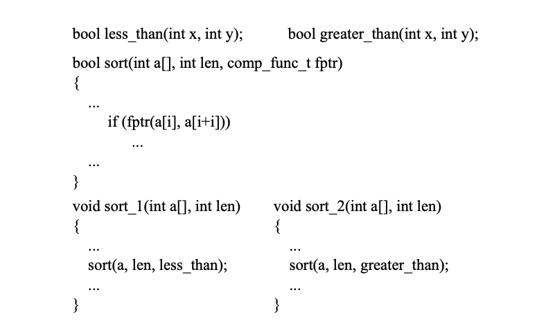
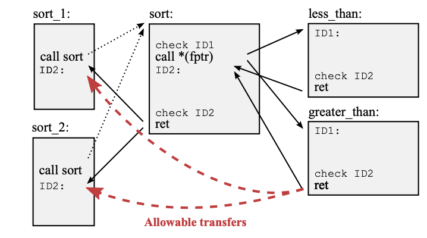
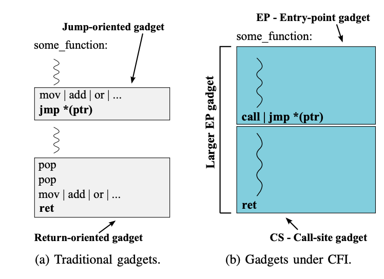
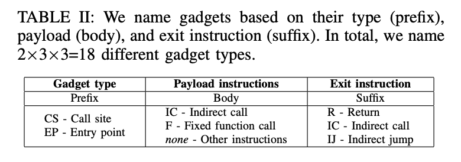
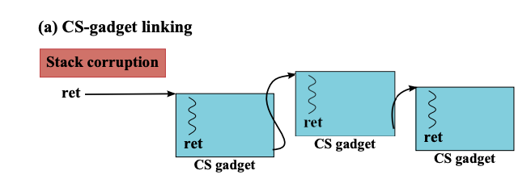
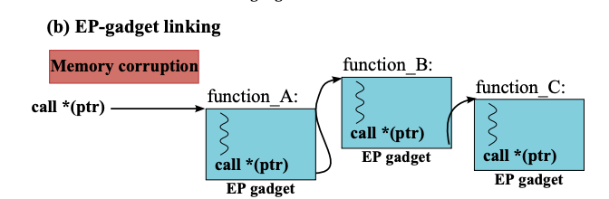
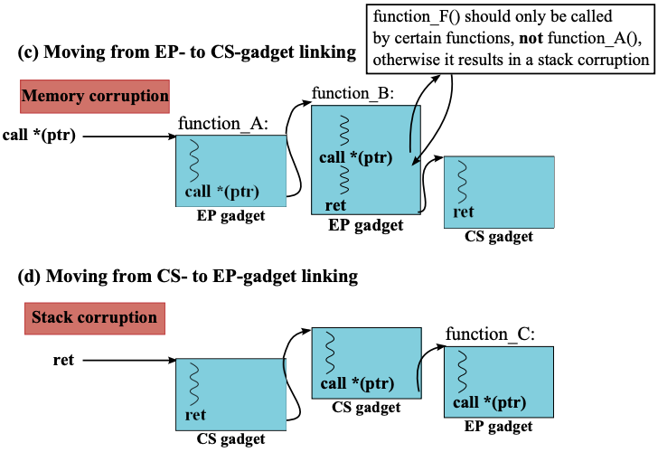
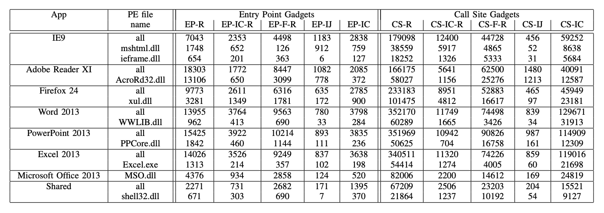

今天要介绍的文章发表在 2014 年的 IEEE S & P，作者是 Herbert Bos 等人。这篇文章首先介绍了早期的 CFI 机制，并指出这些 CFI 机制为了实现方便、性能优化而存在被攻破的可能性。于是作者针对这些 CFI 机制的缺陷构造了一个 Windows 系统下的 PoC。这篇文章年代久远，算是对 CFI 历史发展的学习。

## 什么是 CFI？

计算机漏洞利用中，最经典方式是通过 stack overflow 把 shellcode 注入到 stack 中，通过 overwrite return address 来执行 shellcode，这一般是计算机安全的入门课。针对这样的攻击，人们提出了几种不同的机制来防御：

- DEP（Data Execution Prevention）：用于存数据的内存不能作为指令执行。实现方式如 W ⊕ X：一个 page 的 W 权限和 X 权限是异或关系，不能共存；
- SSP（Stack Smashing Protection）：给编译器增加额外功能，让它能主动感知/防御 stack 被恶意覆写；
- ASLR（Address-space Layout Randomization）：地址随机化，让程序的各个部分基地址在运行时随机决定。

为了绕开 DEP，ROP（Return-oriented Programming）诞生了。ROP 利用程序本身有的代码片段（gadgets）拼凑成出一个完整的 shellcode，这样就无需自己注入新的代码。而 SSP 和 ASLR 也有不同的方式可以绕过，和 ROP 一同使用就会构成新的有效攻击。

为了防御 ROP，人们提出了 CFI（Control-flow Integrity）机制，即保证程序的 control-flow 跳转一定是符合自己预期的。一个理想的 CFI 机制会对程序中所有的 indirect control-flow transfer 做检查。Indirect control-flow transfer 是指目标地址没有写死在指令里的跳转，比如函数调用、返回、非直接跳转等，一般会把目标地址放在一个寄存器中。如果我们在每个 indirect control-flow transfer 前做检查，查看目标地址是不是在事先设置好的列表里，就可以做到阻止 ROP 攻击。

然而实际上的 CFI 实现并不能做到这么强大。首先，这样的检查带来的性能开销过大；其次，商业软件体量过大，并且并不开源，没办法如此细致地实现 CFI 机制。

现实中，在这篇论文写成之时，存在三个 CFI 机制：original CFI、CCFIR 和 bin-CFI。

他们的核心思路都是减少目标地址的 list 大小。原先每个 indirect control-flow transfer 分割开来的基本块前都会有一个自己的 ID，用于做检查。而最初的 CFI 实现提出，我们只需要一个 ID，来 label 所有的跳转。这样的机制粒度过粗，因此 CCFIR 提出使用 3 个不同的 ID，用于 ret 指令、敏感函数中的 ret 指令和 indirect call/jmp 指令。而 bin-CFI 中采用了 2 个不同的 ID：ret & indirect jmp 以及 indirect call。

这样的机制可以在一定程度上挫败攻击者，但是并不是理想中的 CFI 保护机制。比如下图所示的代码中，就存在红色箭头所示的，并不符合程序 CFG（control-flow graph）但是被允许的跳转。

 

## CFI 下的 ROP gadgets

那么是否有可能通过这些红色箭头来实现 ROP 呢？答案是有可能的，只是 gadgets 看起来不太一样:

CFI 下的 gadgets 看起来要更“大”一些，往往是一个基本块最为一个 gadgets（忽略直接跳转的基本块）。这也导致了这些 gadgets 带有的副作用更多，构造时需要额外考虑。

为了在 CFI 保护机制下寻找 gadgets，作者对 gadgets 进行了分类：

根据种类、指令行为和退出方式，gadgets 被分成了 18 类，包含 CS（call site）、EP（entry-point）两个大类。

这些 gadgets 被串起来的方式也非常有趣。CS 类的可以被简单串起来：

类似地，EP 类的也可以被简单串起来：

这里 EP 串起来形成的已经不叫 ROP 了，而是 call-oriented programming，与 ROP 统称为 code reuse attack。

而如果想把 CS 和 EP 之间串起来，则会稍微麻烦一些，需要一些特殊的 gadget 做转换器：

## CFI 下的代码注入

传统的 ROP 被证明是图灵完备的，并且 gadgets 很小，比较灵活。但是有 CFI 后，gadgets 相对比较笨重了，也有更多副作用，很难去直接实现攻击者想要的功能。所以更好的方式还是想办法注入攻击者自己的 shellcode。

为了实现这一点，我们需要绕过 W ⊕ X。如果我们想办法给一个 buffer 执行权限，就可以绕过  W ⊕ X。然而这样的攻击会被 CFI 保护机制阻止，因为 buffer 里的代码显然不在 CFI 允许的列表里。那么我们还有另一个思路：想办法让一个代码段变成可写的，再将其覆盖掉。

如果我们能构造一个 code reuse attack，调用一些特殊函数调整内存权限（windows 下是 VirtualProtect），就可以实现 code injection。

## Gadgets 统计

上面介绍了攻击的思路。后续作者统计了流行软件中所需要的 gadgets 数量：

可见即使在 CFI 保护下，可用的 gadgets 还是很多的。作者使用这些 gadgets 构造了一个 PoC，详细信息可以阅读原文。

## 结语

现在的 CFI 保护技术已经远远不是这篇论文提到的这么简单了，并且出现了很多硬件辅助的 CFI 功能。Linux kernel 中的 CFI 保护也是最近一个很活跃的话题。这篇文章的阅读只是简单回顾一下早期的 CFI 思路，以及对应的攻击思路，这些思路在今天看起来已经很 straight-forward 甚至有些 naive 了。