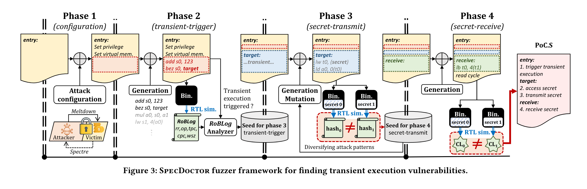
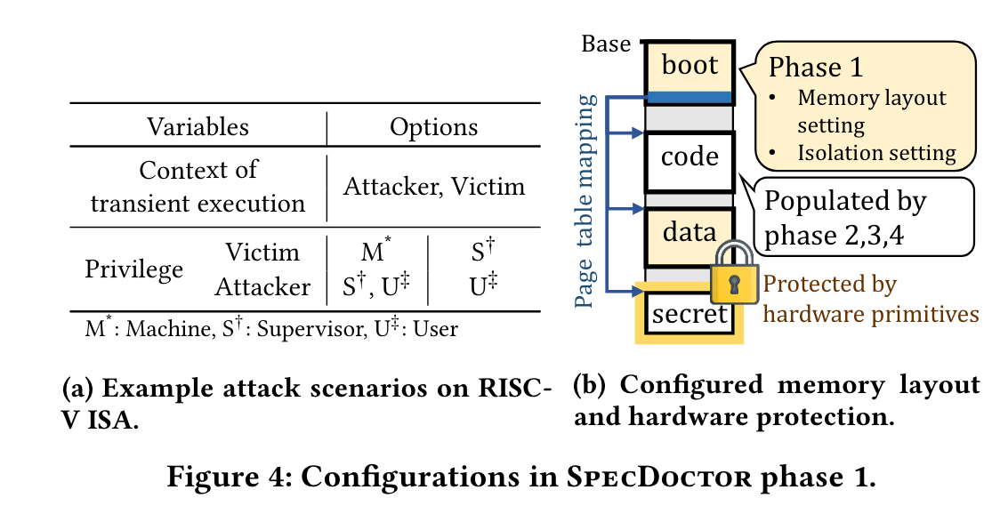

最近在订阅的 Google Scholar 推送中看到了今年 CCS 的一篇文章 Spec-Doctor，与前几天公众号推送的 DIFUZZRTL 研究同一个 topic：对 RTL 进行 fuzzing 来寻找硬件漏洞，作者是来自 Seoul National University 的 Byoungyoung Lee 等人。

## 背景

硬件漏洞中最出名的要数 Spectre 和 Meltdown，它们也被称为 Transient Execution Attacks。当代 CPU 性能优秀的原因之一就是利用了大量的预测进行优化，而这些预测（分支预测、乱序执行等）会被 CPU 提前执行，如果预测正确则把指令执行的结果 commit，这种提前执行被称为 Transient Execution。Transient Execution 在指令层面是无法被察觉的，因为它属于硬件自己进行的优化，与软件解耦。但是如果有一些方法透露 Transient Execution 中 CPU 的状态（如时间等），那么就可能会借此原先无法访问的内存的信息。

而 Transient Execution 漏洞的威胁很大，因为硬件一旦出厂就无法更改，没有办法打补丁根治，因此在 RTL 阶段把漏洞检测出来很有必要。

## 设计思路

Fuzz CPU 硬件实现并不容易：
- Threat Model 有很多种，各种攻击的 context 也都不一样（比如带来 Transient Execution 的 code 可能在 victim 端也可能在 attacker 端）
- 检测 RTL 中出现了 Transient Execution 漏洞并不容易

为此，作者设计了四个阶段：
1. 在各类 threat model 和 context 中随机选择一个（如从 U, S mode 攻击 M mode，或从 U mode 攻击 S mode等）
2. 定位能够触发一次 Transient Execution 的代码
3. 根据第二阶段获得的代码自动生成能触发 Transient Execution 的代码，找到能泄露秘钥的代码
4. 通过 Transient Execution 来泄露秘钥

其中第一阶段 context 设置中，整个内存被分为四个区域：boot, code, data 和 secret，其中 boot 用于配置页表、异常向量表，code 用于储存随机生成的代码，data 的每个 page 都被随机设成不同的 flag，secret 是最终要泄露的秘钥。code 在运行开始前随机生成：首先随机生成 control flow graph，然后根据 CFG 去用随机指令填充每个基本块。第二阶段中利用了 RTL 阶段检测 bug 的优势：与发行了的 CPU 不同，我们是可以主动得知是否发生了 Transient Execution 的，在 rollback 阶段增加一个通知机制即可。第三阶段中同时用静态、动态两种检测方式，来检测 CPU 中的 Timing-change Components。最终阶段则是另一次 fuzzing：不断变换 secret 的同时观测 Timing-change Components 的变化，从而得知时间变化是否能泄露 secret 信息。

## 总结

最终作者对 Boom 和果壳两块 RISC-V 开源 CPU 进行了测试，并都成功找到了新的漏洞，并讨论了这些漏洞的有趣之处。总得来说，这个研究方向非常有趣，这篇论文提出的方法看起来也十分强大，或许这个方向会成为将来 CPU 生产设计中必不可少的一部分。