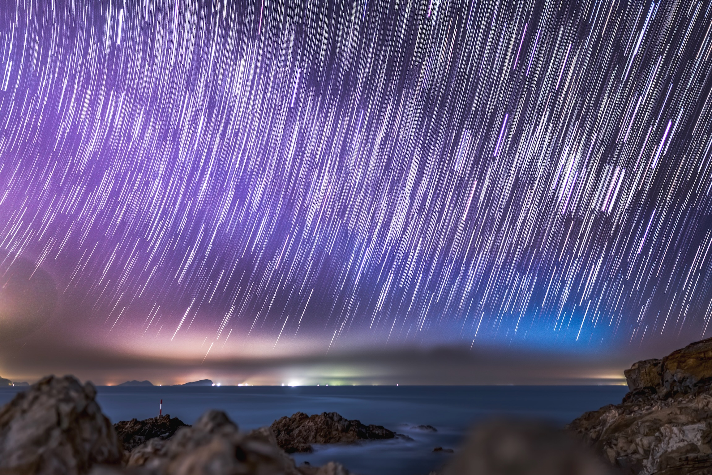

拍星星是我挂念已久的一个愿望。从小生活在天空灰蒙蒙的工业化都市中，满天繁星对我而言从来只出现在课本里、诗歌里或是电影里。自初中开始，我就在各种社区收藏星空拍摄相关的帖子，至今攒了几十个来自世界各地的星空摄影游记。然而直到这个周末，我才有了属于自己的星空之旅。

阻碍我们观看到星星的两大障碍是天气和光污染。在万里无云的月缺之日，才能顺利看到星星，此为天时；在荒无人烟的寂寥之地，星光才不会被光污染遮蔽，此乃地利。因此，我们需要在一个月固定的时间段内，碰上晴朗的天气，赶去荒郊野岭之处，守候到夜半三更。夜班三更在野外需要结伴而行，此为人和。如果不止要观星，还要将星空拍摄下来，专业的设备也是不可或缺的。

上个周末正是这样一个齐聚天时地利人和的机会。淏辰提前确认过天气后邀我和女友一同前往港岛鹤咀观星。他携带了两台设备：索尼 A6400 配 sigma 16mm f1.4 和索尼 A7R3 配 sigma 14-24 f2.8。

我们原先预计五点多到达，还可以在鹤咀拍个日落。然而路上出现了一些小意外，导致我们碰面吃完饭已经七点了。饭后我们从太古乘一辆年代久远的巴士前往鹤咀，下车时已是八点多。车站处是个岔路口，巴士走了一条，我们走了另一条。没走几步，我们便进入了无边黑暗之中。若是在其他旅途中，我们定会怀疑自己走错了路，然而追逐星空的人们越在黑暗中才越坚信他们正朝着正确的道路前进。

借着手机的手电走了十来分钟，星星开始出现在了天空中。路途上偶有车辆会路过，车灯出现后我们便会在路边等候，待车完全通过再继续前行。

路上淏辰告诉我，网上的攻略有说村口有未拴绳子的恶犬，这才是到达目的地的最大障碍。因此远处看到灯光时，我的心理既开心又有些恐慌，并且默默期待着传说中的恶犬不会出现。然而人类对困难总是乐观的，只有当犬吠声袭来，我才开始觉得这黑暗中横在路上的动物是个真正的问题。我们并不知道这些狗是否有接种过疫苗，也不想冒险尝试，只好反复试图经过这段路，遇到犬吠就返回，经过时我们尽量靠路左侧从而远离那些狗。辗转几次后，最后一次竟然真的顺利通过了。

然而攻略并没有告诉我们完整的故事。前行数分钟后，我们听到了新的狗叫声，这次它横在马路中间，黑暗中我甚至看不清它的样子，它用声带用力地发泄着对我们的到来感到的不悦。

我们在此紧张地周旋几次后，一位长者驶车经过了我们，我们便询问他是否愿意帮忙载我们一程。感谢这位好心的长者，让我们渡过了这道难关。

这让我想起了《游褒禅山记》：
> ......夫夷以近，则游者众；险以远，则至者少。而世之奇伟、瑰怪，非常之观，常在于险远，而人之所罕至焉，故非有志者不能至也。有志矣，不随以止也，然力不足者，亦不能至也。有志与力，而又不随以怠，至于幽暗昏惑而无物以相之，亦不能至也。然力足以至焉，于人为可讥，而在己为有悔；尽吾志也而不能至者，可以无悔矣，其孰能讥之乎？

好在我们至于幽暗昏惑而有物以相之，才得以抵达险远之地。

直到数小时后我们意识到回程也有同样的问题，我们才开始想念那位长者和他可爱的车。

下一个难题是找路。面前有两条路，左边的路标注了私人领域，禁止闯入；右边的路被栏杆拦住。我们对着地图反复思索，两条路之间反复尝试，又过了二十分钟，还是未能知道答案。而最终两条路竟然都不正确，正确的路是竟走两条路中间杂草丛生的小水渠。我已经不记得我们是如何想到要尝试走这条路的。只有亲自走上去，才能意识到它真的是一条路。

此后的旅途相比之下就顺畅多了，沿着道路打着手电一路前行，最终到达了一处建筑物：香港大学太古海洋科学研究所。到达之前我都不知道这里竟然有一栋属于港大的建筑。而我竟然此时自动连上了 HKU 的 WiFi ，尽管它的信号微弱到完全不能使用。

 

我们用 Star Walk 确认了银河的方向，终于开始了摄影工作。淏辰用三脚架固定好相机，试图朝着银河的方向拍摄，然而光污染还是过于严重，曝光时间稍长就会导致相片过亮，因而看不到星星。僵局一直持续到了十点，我开始怀疑这世界上是否真的存在能拍到星空的地方之时，旁边村庄的灯全部熄灭了。

这时我用手机开始尝试，设定好 ISO 和 Shutter speed 后，我的华为手机竟然也可以拍到星星。

 

翻越一个小围栏后，可以走到海边的礁石上，在这里拍摄的效果更好，尽管呆着并没有平地舒坦。在那里我们用A7R3拍摄了一些照片（长曝光得到的照片，现实中黑得伸手不见五指）：

 

 

拍摄至一点多，我们决定返程。回去后这些照片将用来堆栈处理合成星空以及星轨。

返程时我们起初试图用 Uber 叫车。但是第一个接单的司机坚持认为村口往里是禁区，不愿意进来，因此取消了订单。实际上禁区是我们所在之处的后面。我们迟迟等不到第二个接单的司机，加上信号不好，我们又一次陷入了僵局。

这时有一对情侣也返程来到了和我们相同的地方，后来得知他们是刚刚在我们旁边山上两个手电筒的来源。他们表示愿意带我们去市里面。车上闲聊，发现对方两人正好也是来自中大和港大的。于是淏辰和中大的老哥开心地闲聊起来，发现他们都认识一些相同的人。你永远可以相信小世界理论。最后他们将我们载到了香港大学地铁站，旅途至此结束。

剩下的任务就是星空图片后期处理了，我简单地学习了堆栈降噪、滤波等常用方法的基本原理。不过留下了几个难题：

- 堆栈降噪会让前景过亮，如何将前景调暗？
- 合成星轨时，飞机路线和星轨十分不协调，如何将飞机从中剔除？

第一点用 PS 就可以简单完成。不过第二点相当棘手。在两天后的电话中，我们讨论出了一种巧妙的算法可以完成这件事，并决定在周末抽空把它实现出来。Well, it worths another blog. 这里就不细谈了。

---

最后附上部分完成处理的图片：

---

给淏辰的 ins 打个广告：

https://www.instagram.com/p/CWDsqfRpZHx/?utm_medium=copy_link

https://www.instagram.com/p/CV-2ftuhgiv/?utm_medium=copy_link