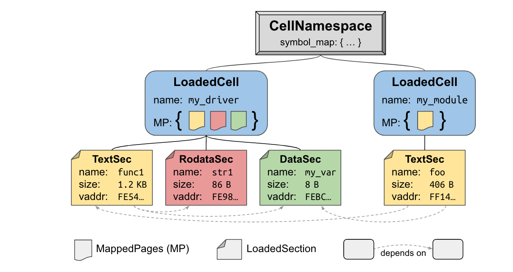

Theseus 发表在 OSDI'20，作者来自 Yale 大学和 Rice 大学。Theseus 相比传统的 OS 文章，采用的思路非常的激进，完全弃用了现有 OS 大多采用的虚拟化和特权等级设计，内存安全则完全由 Rust 语言特性保证。作者用了 PhD 期间几年的功夫独立实现了 Theseus，并用它作为自己的博士毕业论文。

## Problems to solve

Theseus 试图解决的问题有两个：1. 系统中常有的 state spill 问题；2. 语言内 OS 设计（intralingual OS design）。

State spill 是指，如果把某个系统模块看成状态机，它的状态不是自己决定的，而是会在跟其他模块的接触中被改变。这带来的问题是，所有依赖这个模块的其他模块，都会因此共享命运，如果这个模块崩溃了，可能会导致其他所有模块无法使用，因而导致系统崩溃。作者举的例子是 Android，在 Android 中，某个 system service 的 crash 可能会导致整个 userspace framework 崩溃，因而丧失了所有 app 的状态，包括那些甚至没有使用这个 service 的 app。通过避免 state spill，可以实现系统的 fault tolerance 和 live update。

语言内 OS 设计是指，让 OS 的运行环境跟实现 OS 用的语言提供的运行时环境相 match。这样就可以尽可能地享受到编译器静态检查带来的便利。比如：可以使用 Rust 的智能指针实现系统 resource 的管理，从而避免出现资源泄露的问题。

## Theseus 中的模块化

整个 Theseus 系统是由各种各样的 cells 组成的，每个 cell 负责一个系统功能，并且可以在运行的时候被替换掉。所有的 cell 和用户代码共享同一个 address space，共享同一个 privilege level。不过 MMU 依然是需要的，因为需要它来提供 page 的 RWX 权限管理，整个系统都是 linearly mapped，并且要做到保证 physical address 要一一对应 virtual address。

所有的 cell 中只有一个比较特殊的：nano_core。在系统启动阶段，总需要一段 bare metal 的程序来负责初始化，nano_core 就是如此。但是在系统完成启动后，nano_core 就不在被需要，因此可以完全从内存中抹除，只剩下其他符合 live update 要求的 cells。nano_core 启动系统的过程包括配置页表，和 bootstrap 其他若干个 cells。每个 cell 里记录了自己依赖的其他 cell 的信息，因此一个 cell 被 load 的时候，它依赖的其他 cell 也会被 load 进来。

为了让 cells 能在单一地址空间中运行，Theseus 选择在系统里嵌入一个 linker，所有的 cell 在系统镜像中以未 link 的 object file 呈现，最后运行之前才会被 link。

## Theseus 中的 Task

Theseus 中的程序和 OS 交互并非使用类似 system call 这样的 ABI，因为 ABI 很可能会丧失变量的 semantics。每个 task 都类似 rust 中的一个 thread，创建时以 FnOnce 的 type 被 spawn 出来。为了保证单一地址空间下的内存安全，Theseus 并没有选择使用 fork 这样的功能。因为把 Task 看成一个 FnOnce，所以 Theseus 可以直接利用 Rust 的生命周期检查功能，管理 Task 拥有的资源。比如说一个 Task 可以申请一些 MappedPage 作为自己的内存使用，这些内存可以利用 Arc 来进行跨 Task 的共享，当没有 Task 在使用这些 MappedPage 时，MappedPage 就会自动被 drop，drop 期间会对这些 pages 进行 unmap。

## 避免 state spill

为了避免 state spill 的发生，Theseus 中的每个 cell 都尽可能负责管理自己的状态：每个 cell 作为一个 server 不记录 client 的 state，而是让 client 记录它自己的状态，并在 request 中包含状态的信息。这其实采用了 stateless communication 的思路：所有 handle request 需要的信息都应该被包含在 request 本身中。

## 结语：Theseus 设计的优劣

Theseus 的设计主要是为了实现两个目标：Live evolution 和 Fault recovery。得益于使用 cell 的设计，Theseus 可以运行时将某个 cell 进行更新，因为整个系统就是由一些列 cells 构建而成的，所以整个系统都可以通过这种方式被替换。

而发生 fault 时，只有依赖这个 cell 的 apps 可能会发生崩溃，其他 apps 并不会受到影响。并且，在 fault 之后系统会对该 cell 进行 stack unwinding，并逐一释放它占有的资源，从而避免资源泄露。

Theseus 是个很有创意的系统，但是离实践还很远。首先它不支持 POSIX 标准，并且也还没有一个功能完善的标准库，因此暂时并不能广泛支持很多 apps。正如文章标题，开发它只是对革新 OS 设计的一个实验。