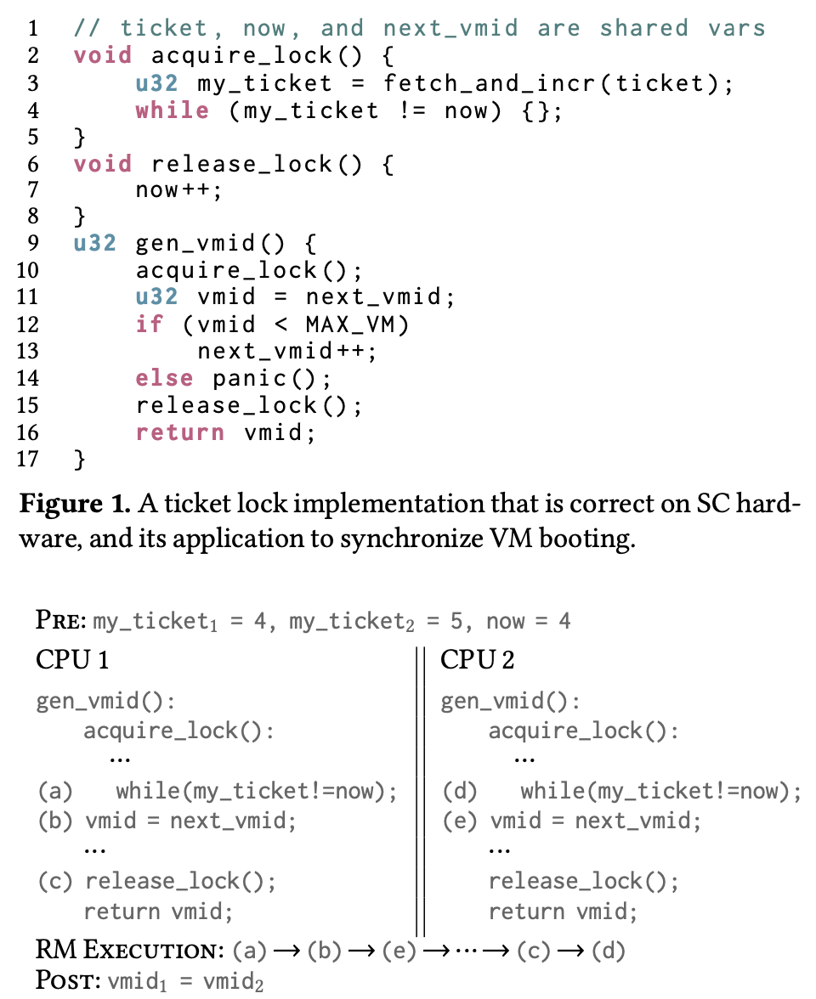
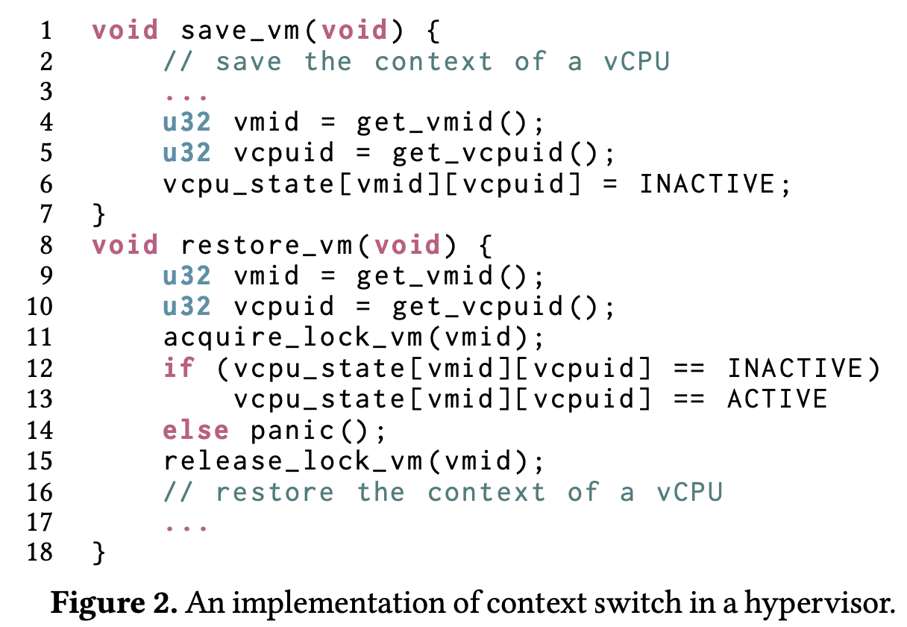
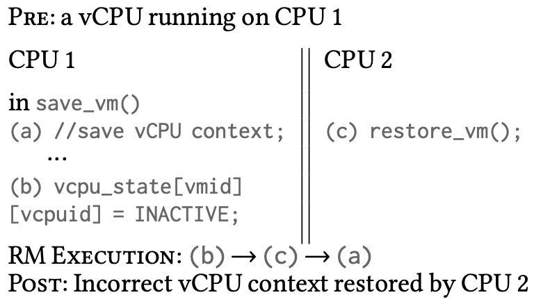
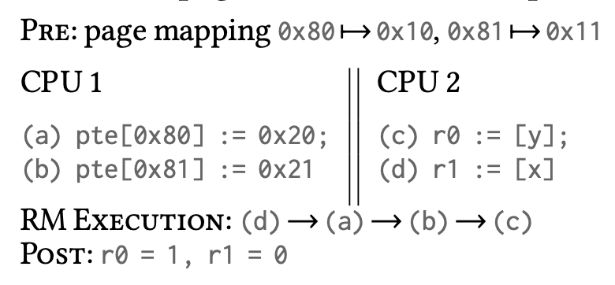
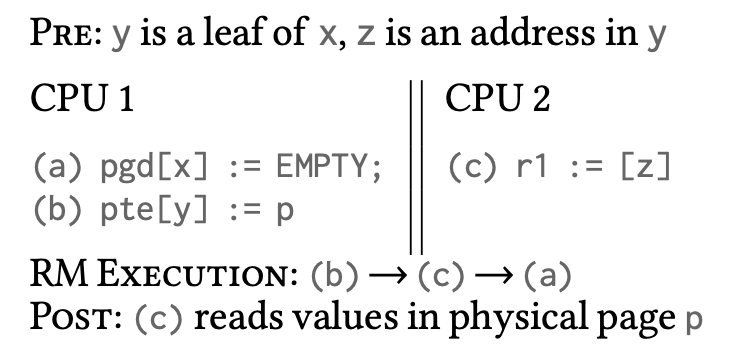
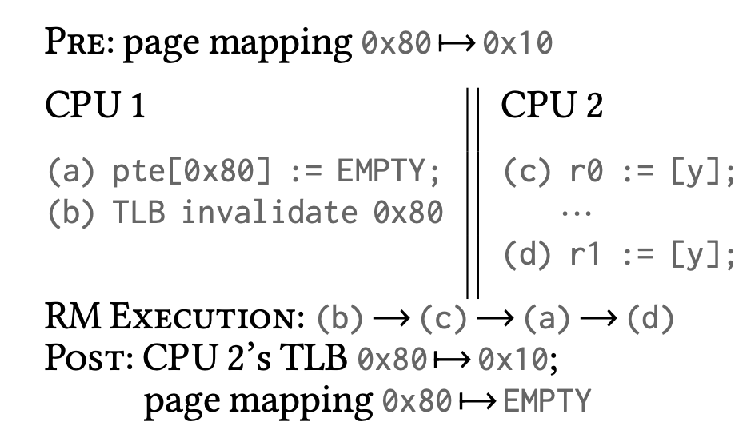
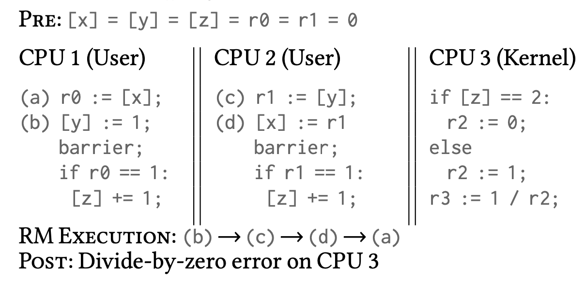

今天要给大家分享的是收录于 SOSP'21 的《Formal Verification of a Multiprocessor Hypervisor on Arm Relaxed Memory Hardware》，作者来自哥伦比亚大学的 Ronghui Gu 教授课题组。顾教授长期研究形式化证明领域，曾经在 OSDI'16 发表过 CertiKOS，一个经过形式化验证的**多核**操作系统，其将操作系统分成 37 个 layers 进行逐层验证。我顺便去[顾教授个人网站](https://www.cs.columbia.edu/~rgu/)看了一眼，最新消息显示，在 2021 年十一月，其创立的 CertiK （一个区块链安全领域的初创公司）获得了接近 10 亿美元的估值。

今天要介绍的这篇工作，第一次实现了在 **Relaxed Memory Model** 下的**多核** Hypervisor 形式化验证。接下来，我将首先介绍什么是 Relaxed Memory Model，以及为什么在 Relaxed Memory Model 下形式化验证是困难的，随后介绍这篇文章是如何处理这些困难并最后实现形式化验证的，最终讨论一下这篇工作的局限以及我个人的思考。


## 从一段 “Bug-free” 的代码开始

今年十月份的某一天，我在 Hacker News 上看到了一个名为[《一个 x86 上不存的 Bug：探索 Arm-only 的 Race Condition》](https://news.ycombinator.com/item?id=28996500)的帖子。这个标题比它指向的 [repo](https://github.com/stong/how-to-exploit-a-double-free) 名字更有吸引力：*how to exploit a double free*。这个 repo 讲述了一个 CTF 的题目，这个题目要求从一个服务器中拿到 shell，该服务器的实现使用了一个 Lock-free 的 Ring Buffer。这段代码在 x86 上是 bug-free 的，但是在 Arm 上存在 data race，因而可以被用来恶意触发一个 double free，从而拿到 shell。文章本身作为一个 CTF 题目的解释非常详细，推荐大家也可以看一看，但是在此我们更关心这个 bug 存在的根本原因：x86 和 Arm 拥有不同的 memory model。

第一眼看到 memory model 这个词的时候，我以为是类似前几天刘念同学分享的 ELASTICLAVE 里的 memory model。但是在读完这篇 repo 里的短文，以及 HN 里的 comments 的之后，我感觉到我的理解不太对。大家都在强调这是 x86 和 Arm 之间的区别，而如果 memory model 只是一个在软件 level 定义的概念的话，那在 x86 上的 model 应该可以完全搬到 Arm 才对，因此这应该是一个硬件上的概念。调查后我发现，memory model 可以有以下几种意思：(1). 管理内存的模型，比如 ELASTICLAVE；(2). Compiler 的内存模型以及 (3). Hardware 的内存模型，其中后两者都与指令的 reorder 有关。当代程序运行的效率依赖于各种优化，其中也包括软件级别的和硬件级别的。对于一段程序，Compiler 可以在编译期判断指令之间的依赖关系，从而对指令重新排序进行优化；而当代处理器大多支持乱序执行，它们会在硬件层面对指令执行顺序进行优化。前者的优化是可以通过观测汇编指令 explicitly 看到的，而后者的优化是不可见的，但是遵循固定的规则，这些规则被总结起来便是一个硬件的 memory model。

下面给出《A Primer on Memory Consistency and Cache Coherence》中的定义：
> - **Memory consistency (consistency, memory consistency model, or memory model)** is a precise, architecturally visible definition of shared memory correctness. Consistency definitions provide rules about loads and stores (or memory reads and writes) and how they act upon memory.
> - The correctness criterion for a single processor core partitions behavior between one correct result and many incorrect alternatives... **even on an out-of-order core**.
> - Shared memory consistency models, however, concern the loads and stores of multiple threads and usually allow **many correct executions** while disallowing many (more) incorrect ones.  

从中我们可以得知，memory model 是 memory consistency model 的简称，它是对机器执行的 correctness 的判定。对于单核处理器，memory model 的定义相对简单，即使是乱序处理器中，memory model 也会规定只有唯一一种正确的执行（注：这唯一一种不一定是开发者想要的，或者并不一定对开发者而言是正确的），这是因为一切都是确定性的。而对多核处理器，memory model 会 tricky 很多，因为有不可避免的不确定性，因此 memory model 只能规定什么样的执行是不正确的，并承认剩下可能的执行都是正确的。而正确性不唯一带来的麻烦，就交给软件开发者来考虑了。

## Sequentially Consistent Model 和 Relaxed Memory Models

《[Memory Consistency Models: A Tutorial](https://www.cs.utexas.edu/~bornholt/post/memory-models.html)》是一篇很好的博客文章，介绍了 memory model 中的一些基本概念。从中可以得知，最简单的多核 memory model 是 SC (Sequentially Consistent Model，别处也称SO，Sequential Ordering)，思路是将多核的执行看成是一个核的执行，强行将内存访问的执行流合并起来。比如考虑如下例子（这个经典的例子和论文中的 Example 1 一样）：

``` Python
# Initially both global variables are 0
A = 0
B = 0

# Thread 1
(a) A = 1
(b) r1 = B

# Thread 2
(c) B = 1
(d) r1 = A
```

那么在执行后，对于 Thread 1 和 Thread 2 中的 r1 寄存器，我们有如下几种可能：
- 11：比如`(a)->(c)->(b)->(d)`，
- 01：比如`(a)->(b)->(c)->(d)`，
- 10：比如`(c)->(d)->(a)->(b)`，

但很容易发现结果不可能是 00。因此在 SC 模型中，11、01 和 10 都被认为是*正确*的结果，而 00 则是错误的（again，对开发者并不一定三种都是*想要*的）。

SC 模型基于的假设就是程序是以 program order 执行的，并且多核之间的内存访问一定有严格的时间顺序（比如用一个无比精确的时间戳来判断）。因此 SC 并不能直接应用于现代处理器中：1. 处理器中有 cache，多个处理器并不是直接访问内存，因此不一定能严格定序；2. 现代处理器支持乱序执行，打破了 SC 的假设。而如果我们强制要求一个多核顺序处理器使用 SC 模型，它将变得非常慢，因为执行流本质上等价于一个单核处理器。

那么为了解决 SC 的问题，当代处理器支持的内存模型是 relaxed memory model，它们比 SC 放松了一些条件。其中包括 x86 的 TSO（Total Store Order）和 Arm 的（Weak Memory Model）。首先这些模型都允许 Cache 的存在。其次，TSO 要求所有的 store 指令都是顺序执行的，而 load 指令可以被 reorder；Arm 则更加放宽了条件：所有指令在满足依赖关系的前提下都可以被 reorder，因此叫做 weak memory model。相比于 TSO， weak memory model 效率更高，但是更加不稳定，因此依赖软件中显式地插入 memory barrier 指令（fence指令，像围栏一样不允许指令跨过）来保证程序执行的正确性。而无论是 TSO 还是 weak memory model，刚刚的 example 中 00 都被认为是*正确*的结果。这个例子显然不足以区分 TSO 和 Weak memory models，因为两者都包含了所有可能的结果，而之前提到的 Arm-only Race Condition 则是一个区分二者的很好的例子。

Weak memory model 实际上也是一个统称，而不是一个具体的模型。有一些具体模型的例子，比如 RISC-V 采用的 RVWMO（RISC-V Weak Memory Ordering）、Promising model（被证明等价于 Armv8 实现的模型，但是表达较为简洁）等。

## Too Weak to be Verified

在初步了解了 memory model 这个有趣的概念后，我惊讶于我之前竟然从来没有听说过它，因此我便去查找相关的学术工作，其中最新的便是今天的主角，发表在 SOSP 21 的这篇文章。

在这篇工作之前，已经有一些经过形式化验证的 OS/Hypervisor，比如 (a) seL4、Komodo、Serval 以及 (b) CertiKOS、AtomFS、Mailboat、SeKVM。但是 (a) 组中的工作全部都假设了单核处理器；而 (b) 组中的工作虽然支持多核，但都假设了 SC 内存模型，因此在现实机器中的正确性并不能保证。其中 CertiKOS 原文最后有相关的讨论：他们认为尽管证明是在 SC 下做的，但是 *they believe* 相同的结论对 TSO 也成立，并给出了自己的分析。因此，此前没有任何工作的形式化证明对 Arm 机器来说是适用的，谁也不能证明现有的工作中不存在 Arm-only Race Conditions。

但是在 Weak memory model 下形式化验证是很不容易的，因为它比 SC 弱化太多了，因此支持的可能的执行结果也更多，形式化验证的过程也就更加复杂，它要从更多硬件上*正确*的结果中判断哪些可能是不正确的。（注：形式化验证下的正确性便是开发者真正想要的正确性。）为了解决这个问题，作者认为，如果我们能给软件增加一些约束，并证明这些约束可以使得 SC 下做过的形式化验证结论对于满足约束的软件同样适用，这样我们就可以基于之前的工作实现 weak memory model 的形式化验证。


## Relaxed Memory Model 下的 Data Race 例子

为了找出我们应该规定哪些约束，作者先考察了六种 Relaxed Memory Models 中特有的 bug，这些程序在 SC 下是 bug-free 的，但是在 Relaxed Memory Models 中可能存在 data race。这些 bug 即使使用了常用的同步手段，在乱序执行下依然存在漏洞。下面先给出六个例子，并简要地进行讨论。

### 通过锁同步的共享内存访问



这个例子是在 Hypervisor 创建 VM 时，通过 `get_vmid()` 获得当前空闲的 id，并通过一个排号自旋锁来防止 id 冲突。图中 RM Execution 是一种 Relaxed Memory Model 中可能的执行流，如果这种执行发生，即使我们程序中加了锁，依然会导致两个 thread 拿到冲突的 id。

### 通过辅助变量同步的共享内存访问



这个例子展示了一个 VM context switch 时，Hypervisor 进行的管理操作（注：这里的`get_vmid()`应该和 example 1 里的不是一个函数）。VM 从 CPU 1 switch 到 CPU 2 上执行。而这个例子对应的可能出问题的 RM Execution 为



这样会导致 CPU 1 还没有 save context，CPU 2 就已经 restore 了，因此拿到的是旧的 context。

以上两个例子是关于共享内存中储存的变量的 data race。内存中还有一个十分特殊的共享变量：页表。页表特殊在它会被 MMU 硬件直接访问，因此即使页表被很好地同步了，依然可能会存在 MMU 访问带来的 data race。

### 共享页表访问



这是页表乱序读取导致的 bug。在 SC 中，`r0 = 1, r1 = 0` 是不可能出现的结果，但是在 RM 中可以出现。类似地，还有页表乱序写入导致的 bug：



### TLB 管理

除了页表外，乱序执行中 TLB 的驱逐也可能会有问题：



### User space 和 Kernel Space 之间的信息流

最后，如果我们要验证一个 Kernel，那么 Kernel 的表现不应该依赖于用户程序的正确性。但是当用户空间和内核空间共享一些变量时，可能会导致内核空间出现 bug：



对于 Hypervisor 来说，把这里的 User space 换成 VM、Kernel Space 换成 Hypervisor Space，同样的讨论依然成立。

限于篇幅，我在此只是简要地介绍了这六个例子。这些例子的具体讨论可以参考原文。

## 弱化版的 Data-race free 条件

正如之前提到的，作者的思路是定义一些额外的约束，如果 kernel 的代码实现满足这些约束，就可以使得在 SC 上的证明同样适用于 RM。受此前列举的例子启发，作者总结了六个 wDRF(weak Data Race Free) 条件：

- **(DRF-KERNEL) 除了同步方法和页表管理外，所有的共享内存访问都使用同步原语进行了合适的同步。**（同步方法本身用到的变量没办法再用同步方法同步，只能依赖原子变量、增加内存 barrier 确保正确；而页表管理即使简单地用同步方法同步了，依然如之前的例子所示，会因为 MMU 和 TLB 的存在导致 data race）
- **(NO-BARRIER-MISUSE) 同步方法的实现和临界区域中都合适地使用了 memory barrier。** 这条加上上一条，就可以保证去除了大部分 data race，只剩下页表相关的部分。
- **(WRITE-ONCE-KERNEL-MAPPING) Kernel 自己使用的线性映射段 page table 只能被写入一次。** hypervisor 或者 kernel 在启动时，必须把整个物理内存区域（应该也包括 MMIO 区域）完全线性映射，此后再也不修改。
- **(TRANSACTIONAL-PAGE-TABLE) 临界区域中的页表写入必须是 transactional 的**，其中 *transactional* 定义为：无论页表写入怎么 reorder，page table walk (by MMU) 都只能看到三种可能，(1) 所有页表写入发生之前的结果；(2) 顺序执行所有页表写入之后的结果；(3) page fault。其中 (2) 并不要求实际过程是顺序的，只要结果与顺序执行的一致即可。
- **(SEQUENTIAL-TLB-INVALIDATION) 一次 page table 的 unmap 或者 remap 之后必须跟者一个 TLB invalidation，并且二者之间要有一个 barrier。**
- **(MEMORY-ISOLATION) Kernel space 和 User space 的内存是隔离的。** User space 不能修改 Kernel space 的内存，**并且**满足要么 (1) kernel 从来不读 user memory；要么 (2) SC 模型下的 kernel verification 不依赖用户程序的具体实现。

定义了 wDRF 条件后，作者引出了核心的定理：

> Theorem 1 (wDRF theorem). For any system that satisfies the wDRF conditions, for any piece of the kernel program 𝑃 , any possible observable behavior of 𝑃 on Armv8 RM hardware is also observable on an SC model.

只要证明了这个定理，我们就可以使用前人基于 SC 的工作来在 Armv8 上进行证明了。

## Theorem 1 证明思路

证明被分为两个部分。首先我们证明一段只跑在 kernel space，与 user space 毫无关联的 kernel 代码，只要满足 DRF-KERNEL, NO-BARRIER-MISUSE, WRITE-ONCE-KERNEL-MAPPING，就在 RM 和 SC 下有相同的执行结果。

其次再证明如果 kernel 进一步满足 TRANSACTIONAL-PAGE-TABLE, SEQUENTIAL-TLB-INVALIDATION 和 MEMORY-ISOLATION，就可以保证 kernel 总是在 RM 和 SC 下有相同的执行结果，不管 user program 和 kernel 如何交互。

证明的具体论述可以参考原文。

## 实现 SeKVM

SeKVM 是此前在 SC 下经过形式化证明的 KVM 实现，来自于同一个课题组。此前 SeKVM 在 SC 下的证明使用了 3 万行 Coq。而这次工作使用了 3.4k 行 Coq 证明了 wDRF 条件本身的充分性，再使用 3.8k 行 Coq 证明了 SeKVM 满足 wDRF 条件，从而完整地形式化验证了 SeKVM。然而我没有找到这些 Coq 代码的开源项目。

## 一些思考

- Memory model 这个方向目前多与 PL、形式化验证等方向有关，相对不是一个广为人知的概念。目前似乎没有在 TEE 中考虑 memory model 带来的影响的工作。
- RISC-V 使用的 RVWMO 也是一种 weak memory model，理论上会有相同的问题。（但是复现这些 bug 需要一个支持乱序执行的处理器，但目前手上的板子是顺序执行的，暂时没有办法进行小实验，也许可以考虑用 FPGA 烧一个 BOOM (Berkeley Out-of-Order Machine) 试试。）此外，RISC-V 还有一个 extension 用来支持 TSO。
- 文中提到的六个例子让我非常印象深刻，因为所示代码和我们自己项目中的实现有很多类似之处。在我 check 之后，OpenSBI 自己提供的锁中使用了 memory barrier，但是我们对锁的使用是否完全正确，会不会有文章中提到的问题，还需要进一步 check。
- RISC-V 的 TLB flush 指令是 `sfence.vma`，根据调研结果，这条指令并不能当成一个 memory barrier，还是需要配合其他 `fence` 指令一起使用。
- 目前的工作有哪些通过动态/静态检测的方法，发现 “Arm-only race condition” 的，还需要进一步调研。
- 这篇工作的 WRITE-ONCE-KERNEL-MAPPING 是否是一个过于 restrictive 的条件？能否增加一些其他约束使得 page table 可以被 kernel 修改？
- 六个 condition 里有四个都是和 page table 相关的。文中提到原因是 page table 会被 MMU 直接硬件读取，所以需要特殊处理。所有的 IO 设备也都是直接硬件读取的，如果考虑 IO 的 race condition，是否会需要向 wDRF 条件中加入更多的条目？

## One More Thing

Apple Silicon 是如何处理这个问题的？在苹果的 M1 芯片上用 Rosette 2 跑 x86 程序，会不会遇到 Arm-only 的 bug？答案：不会，因为 Apple 在 M1 上同时实现了两种 memory model !!

据网友逆向工程的结果，M1 的 CPU 中存在一个叫 `S3_0_C15_C9_0` 的 CSR （我开始好奇苹果加了多少定制的 CSR），其中的一个 bit 用来管理是否 enable TSO。
使用这个 customized kernel extension (https://github.com/saagarjha/TSOEnabler)，就可以让自己的进程也启用 TSO。